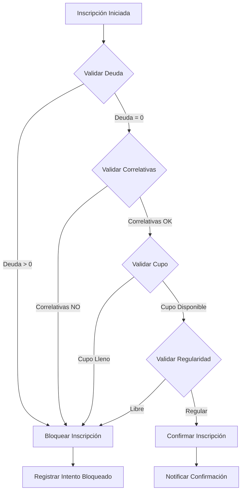
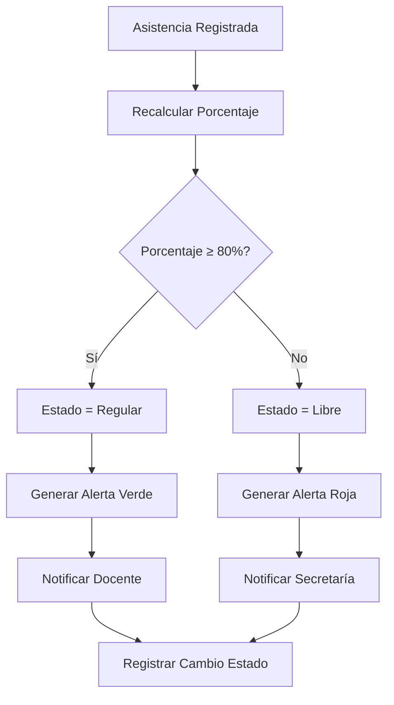
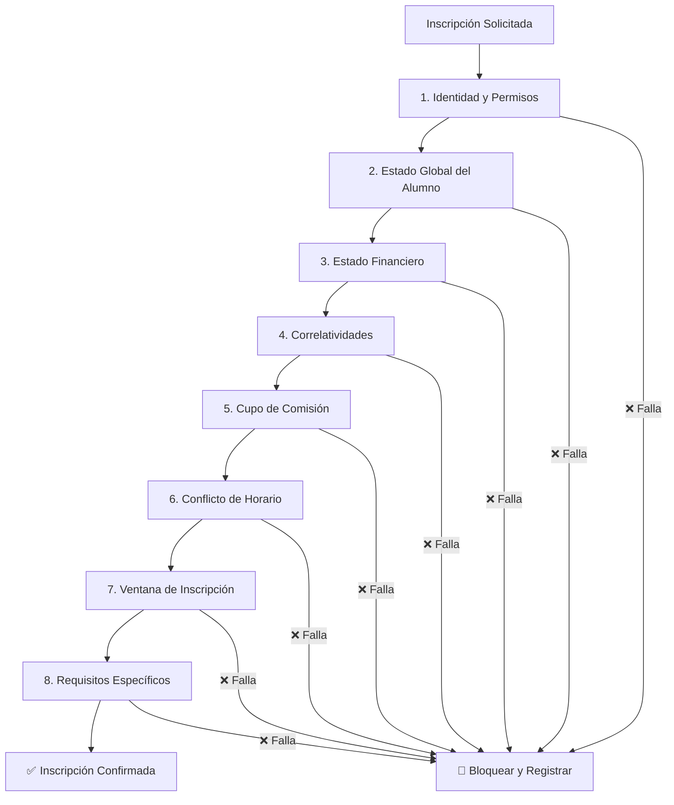

# DOMAIN_MODEL.md
# Modelo de Dominio del Sistema
Instituto Superior de Formación Docente – Paulo Freire

---

## 🎯 Propósito

Definir formalmente los estados del dominio, transiciones válidas y eventos del sistema para garantizar consistencia lógica y evitar ambigüedades durante el desarrollo.

---

## 1️⃣ Estados del Alumno

### 1.1 Estado Global del Alumno

| Estado | Descripción | Condiciones | Transiciones Permitidas |
|--------|-------------|-------------|------------------------|
| **Activo** | Alumno regular en el sistema | Matrícula vigente, no sancionado | Suspendido, Baja, Egresado |
| **Suspendido** | Sanción temporal o administrativa | Decisión institucional | Activo, Baja |
| **Baja** | Ha abandonado la carrera | Decisión propia o institucional | Inactivo |
| **Egresado** | Ha completado todas las materias | Todas las materias aprobadas | Inactivo |
| **Inactivo** | Estado final, sin acciones posibles | Egresado o Baja | - |

### 1.2 Regularidad por Materia/Comisión

**Importante**: La regularidad es por cursada/materia, no global del alumno.

| Estado | Descripción | Condiciones | Transiciones |
|--------|-------------|-------------|--------------|
| **Regular** | Cumple requisitos de asistencia en cursada | Asistencia ≥ 80% (configurable) | Libre |
| **Libre** | No cumple requisitos de asistencia | Asistencia < 80% | Regular (recuperación) |
| **Pendiente** | Cursada en progreso, aún sin definir | Período lectivo vigente | Regular, Libre, Abandonada |
| **Abandonada** | Alumno abandonó la cursada | Decisión o inasistencia prolongada | Libre |

**Ejemplo**: Un alumno puede estar:
- **Globalmente**: Activo
- **En Matemáticas**: Regular
- **En Física**: Libre
- **En Química**: Pendiente

### 1.3 Estados Financieros

| Estado | Descripción | Condición | Acciones Permitidas |
|--------|-------------|-----------|-------------------|
| **Al Día** | Sin deuda pendiente | Deuda = 0 | Todas las acciones académicas |
| **Con Deuda** | Deuda pendiente > 0 | Deuda > 0 | Bloqueo de inscripciones |

**Nota**: Las becas se modelan como atributos financieros, no como estados.

---

## 2️⃣ Estados de Inscripción a Cursada

| Estado | Descripción | Condiciones | Transiciones |
|--------|-------------|-------------|--------------|
| **Pendiente** | Inscripción creada, no confirmada | Datos cargados | Inscripto, Rechazada |
| **Inscripto** | Inscripción activa y válida | Validaciones OK | Baja |
| **Rechazada** | Inscripción bloqueada por validaciones | Falla en reglas | Pendiente (corrección) |
| **Baja** | Alumno renuncia a la cursada | Decisión propia | - |

**Nota**: La regularidad (Regular/Libre) se maneja en la entidad `regularidad_cursada`, no en inscripción.

### 2.1 Estados de Mesa de Examen

| Estado | Descripción | Condiciones | Transiciones |
|--------|-------------|-------------|--------------|
| **Programada** | Mesa creada, no abierta | Fecha futura | Inscripción Abierta, Anulada |
| **Inscripción Abierta** | Período de inscripción activo | Fecha actual o cercana | Inscripción Cerrada, Anulada |
| **Inscripción Cerrada** | No más inscripciones | Fecha límite cumplida | En Curso, Reprogramada |
| **En Curso** | Examen siendo rendido | Fecha y hora actual | Cerrada |
| **Cerrada** | Examen terminado, notas cargando | Todos rendieron | Acta Generada |
| **Acta Generada** | Acta oficial creada | Notas cargadas | - |
| **Anulada/Reprogramada** | Mesa cancelada o movida | Decisión institucional | Programada (nueva fecha) |

### 2.2 Estados de Acta

| Estado | Descripción | Condiciones | Transiciones |
|--------|-------------|-------------|--------------|
| **Borrador** | Acta en creación | Notas siendo cargadas | Revisión |
| **Revisión** | Esperando validación | Notas cargadas, sin errores | Generada, Rechazada |
| **Generada** | Lista para firma institucional | Validación OK | Cerrada |
| **Cerrada** | Acta oficial válida | Firma digital completada | Rectificada (con permisos) |
| **Rectificada** | Acta modificada oficialmente | Error detectado y corregido | Cerrada |
| **Rechazada** | Con errores detectados | Validación fallida | Borrador |
| **Anulada** | Acta invalidada completamente | Decisión institucional | - |

### 2.3 Estados de Deuda (Value Object Derivado)

**La deuda no es un estado persistido, sino un Value Object calculado dinámicamente:**

```
DEUDA_TOTAL = 
  SUMA(CUOTAS_EMITIDAS) 
  - SUMA(PAGOS_REALIZADOS) 
  - SUMA(BECAS_APLICADAS) 
  + SUMA(RECARGOS)
  - SUMA(DESCUENTOS_PUNTUALES)
```

**Nota de Diseño**: En `DATABASE_DESIGN.md` se incluye columna `deuda_total` como **proyección optimizada** (cache), pero en dominio se considera siempre un cálculo dinámico para garantizar consistencia.

**Eventos que recálculan la deuda:**
- Emisión de nueva cuota
- Registro de pago
- Aplicación/modificación de beca
- Cambio en recargos o descuentos
- Ajustes manuales autorizados

---

## 5️⃣ Eventos del Dominio

### Eventos Académicos

| Evento | Descripción | Datos Asociados | Acciones Disparadas |
|--------|-------------|------------------|-------------------|
| **InscripcionCreada** | Nueva inscripción generada | alumno_id, comision_id, fecha | Validaciones automáticas |
| **InscripcionConfirmada** | Inscripción validada y activa | inscripcion_id, confirmada_por | Notificación al alumno |
| **NotaCargada** | Calificación registrada | alumno_id, materia_id, nota, docente_id | Recálculo de estado académico |
| **AsistenciaRegistrada** | Asistencia del día registrada | alumno_id, comision_id, fecha, presente | Recálculo de regularidad |
| **RegularidadCambiada** | Estado de regularidad modificado | alumno_id, estado_anterior, estado_nuevo | Notificación administrativa |
| **RegularidadRecuperada** | Recuperación manual de regularidad | alumno_id, comision_id, motivo, recuperado_por | Auditoría y notificación |
| **ActaGenerada** | Acta oficial creada | mesa_id, acta_id, fecha_generacion | Auditoría automática |

### Eventos Financieros

| Evento | Descripción | Datos Asociados | Acciones Disparadas |
|--------|-------------|------------------|-------------------|
| **PagoRegistrado** | Pago ingresado al sistema | alumno_id, monto, concepto, fecha | Recálculo de deuda |
| **DeudaActualizada** | Estado financiero modificado | alumno_id, deuda_anterior, deuda_nueva | Validación de bloqueos |
| **BecaAplicada** | Beca asignada al alumno | alumno_id, tipo_beca, valor, vigencia | Recálculo financiero |
| **BloqueoEstadoCambiado** | Estado de bloqueo modificado | alumno_id, tipo_bloqueo, estado_anterior, estado_nuevo | Registro en auditoría |
| **IntentoInscripcionBloqueado** | Intento de inscripción rechazado | alumno_id, motivo, detalles | Registro para análisis |

### Eventos Administrativos

| Evento | Descripción | Datos Asociados | Acciones Disparadas |
|--------|-------------|------------------|-------------------|
| **UsuarioCreado** | Nuevo usuario en sistema | usuario_id, rol, email | Envío de credenciales |
| **RolModificado** | Cambio en rol de usuario | usuario_id, rol_anterior, rol_nuevo | Actualización de permisos |
| **ConfiguracionModificada** | Cambio en parámetros sistema | parametro, valor_anterior, valor_nuevo | Notificación a administradores |

---

## 6️⃣ Transiciones de Estado Críticas

### Flujo de Validación de Inscripción



### Flujo de Cambio de Regularidad



---

## 7️⃣ Reglas de Transición

### Reglas Generales

1. **No se puede pasar de Libre a Regular sin acción explícita** (recuperación académica manual)
2. **Una vez Egresado, solo se puede pasar a Inactivo**
3. **Estados financieros solo pueden ser modificados por roles autorizados**
4. **Actas Firmadas no pueden ser modificadas, solo consultadas**
5. **Inscripciones Confirmadas solo pueden ser canceladas por autoridad**
6. **La recuperación de regularidad requiere evento explícito `RegularidadRecuperada`**

### Validaciones Cruzadas

- **Estado Académico vs Financiero**: Deuda > 0 impide ciertas transiciones académicas
- **Regularidad vs Inscripción**: Estado Libre impide nuevas inscripciones
- **Historial vs Estado Actual**: Todo cambio debe estar justificado en historial

---

## 8️⃣ Invariantes del Dominio (Leyes del Sistema)

### 8.1 Invariantes de Inscripción

- **INV-INS-01**: No puede existir inscripción confirmada si el alumno no está en estado `Activo`.
- **INV-INS-02**: No puede existir inscripción confirmada si `deuda_total > 0`.
- **INV-INS-03**: No puede existir inscripción confirmada si no cumple todas las correlatividades.
- **INV-INS-04**: No puede existir inscripción confirmada si la comisión no tiene cupo disponible.
- **INV-INS-05**: No puede existir inscripción confirmada si hay conflicto de horario.
- **INV-INS-06**: No puede existir inscripción confirmada si el alumno está `Suspendido` o `Baja`.

### 8.2 Invariantes de Notas y Actas

- **INV-NOT-01**: Una nota final debe estar asociada a una mesa de examen válida.
- **INV-NOT-02**: Una nota final debe estar en el rango [0, 10].
- **INV-NOT-03**: No puede cargarse nota si el docente no está asignado a la comisión/mesa.
- **INV-ACT-01**: No puede cerrarse un acta si faltan notas finales de alumnos inscriptos.
- **INV-ACT-02**: No puede modificarse un acta en estado `Cerrada` sin permisos especiales.
- **INV-ACT-03**: Una acta solo puede cerrarse si todos los datos son consistentes.

### 8.3 Invariantes de Asistencia y Regularidad

- **INV-ASI-01**: No puede registrarse asistencia en una comisión si el alumno no está inscripto.
- **INV-ASI-02**: El porcentaje de asistencia debe calcularse sobre total de clases dictadas.
- **INV-ASI-03**: No puede registrarse asistencia en fechas futuras.
- **INV-REG-01**: El cambio de estado Regular/Libre debe dispararse automáticamente.
- **INV-REG-02**: Un alumno no puede estar Regular y Libre en la misma cursada simultáneamente.

### 8.4 Invariantes Financieros

- **INV-FIN-01**: No puede existir pago con monto negativo.
- **INV-FIN-02**: La deuda total debe ser siempre >= 0.
- **INV-FIN-03**: No puede aplicarse beca si el alumno no está `Activo`.
- **INV-FIN-04**: Los bloqueos académicos por deuda deben ser automáticos y reversibles.

### 8.5 Invariantes de Estado Global

- **INV-EST-01**: Todo alumno debe tener exactamente un estado global activo.
- **INV-EST-02**: No puede pasar de `Egresado` a cualquier otro estado excepto `Inactivo`.
- **INV-EST-03**: Todo cambio de estado debe quedar registrado en `estado_alumno_historial`.
- **INV-EST-04**: No puede haber dos estados `Activo` simultáneos para el mismo alumno.

### 8.6 Invariantes de Período Lectivo

- **INV-PER-01**: No puede existir inscripción fuera de un período lectivo válido.
- **INV-PER-02**: No puede registrarse asistencia fuera del período lectivo activo.
- **INV-PER-03**: No puede cerrarse un período lectivo con inscripciones pendientes.
- **INV-PER-04**: No puede haber más de un período lectivo activo simultáneamente.

### 8.7 Invariantes de Duplicidad

- **INV-DUP-01**: No puede existir más de una inscripción activa a la misma materia en el mismo período lectivo.
- **INV-DUP-02**: No puede existir más de una regularidad activa para el mismo alumno y comisión.
- **INV-DUP-03**: No puede existir más de un estado financiero activo para el mismo alumno.
- **INV-DUP-04**: No puede existir más de una beca activa del mismo tipo para el mismo alumno.

**Estos invariantes son LEYES del sistema. Cualquier violación debe ser considerada un bug crítico.**

---

## 9️⃣ Precedencia de Reglas (Orden de Validación)

### 9.1 Orden de Validación para Inscripción a Cursada



**Descripción Detallada:**
1. **Identidad y Permisos**: Verificar usuario autenticado y con permisos de inscripción
2. **Estado Global**: Alumno debe estar `Activo` (no `Suspendido` ni `Baja`)
3. **Estado Financiero**: `deuda_total` debe ser = 0 (excepto beca total)
4. **Correlatividades**: Todas las materias correlativas deben estar aprobadas
5. **Cupo**: Comisión debe tener disponibilidad
6. **Horario**: No debe haber superposición con otras cursadas
7. **Ventana**: Debe estar dentro del período de inscripción habilitado
8. **Requisitos**: Prerrequisitos específicos de la materia

### 9.2 Orden de Validación para Inscripción a Mesa de Examen

1. **Identidad y Permisos**: Usuario autenticado con permisos
2. **Estado Global**: Alumno debe estar `Activo`
3. **Estado Financiero**: `deuda_total` <= límite configurado (ej: 2 cuotas)
4. **Habilitación de Cursada**: Debe tener regularidad o condición para rendir
5. **Correlatividades**: Materias correlativas aprobadas
6. **Cupo de Mesa**: Disponibilidad en la mesa
7. **Ventana de Inscripción**: Dentro del período habilitado
8. **Requisitos Específicos**: Condiciones particulares de la mesa

### 9.3 Orden de Validación para Cierre de Acta

1. **Permisos**: Usuario con rol autorizado para cerrar actas
2. **Estado Mesa**: Mesa debe estar `Cerrada`
3. **Completitud**: Todas las notas de alumnos inscriptos cargadas
4. **Consistencia**: Notas en rango válido [0,10]
5. **Tribunal**: Todos los miembros del tribunal asignados
6. **Fecha**: Fecha de examen válida y pasada
7. **Validaciones Cruzadas**: Sin inconsistencias en datos

### 9.4 Puntos de Interrupción y Recuperación

- **Fallo en validaciones 1-2**: Bloqueo inmediato, registrar intento en auditoría
- **Fallo en validaciones 3-8**: Opción de solicitar excepción con justificación
- **Éxito total**: Confirmación automática y registro de evento

**Este orden es estricto y no puede ser modificado sin análisis formal de impacto.**

---

## 🔟 Mapeo Dominio → Base de Datos

### 10.1 Tabla de Correspondencia

| Concepto del Dominio | Se Persiste | Entidad DB | Observaciones |
|---------------------|-------------|------------|---------------|
| Estado global alumno | Sí | `alumno.estado_global` | Enum: Activo, Suspendido, Baja, Egresado, Inactivo |
| Estado financiero | Sí | `alumno.estado_financiero` | Enum: Al Día, Con Deuda |
| Beca aplicada | Sí | `beca` (tabla separada) | Atributo financiero, no estado |
| Regularidad por materia | Sí | `regularidad_cursada` (nueva tabla) | clave compuesta: alumno_id + comision_id |
| Cambio de estado global | Sí | `estado_alumno_historial` | Registro completo de transiciones |
| Cambio de regularidad | Sí | `regularidad_cursada_historial` | Historial de cambios por cursada |
| Inscripción estado | Sí | `inscripcion.estado` | Estados: Pendiente, Inscripto, Rechazada, Baja |
| Mesa examen estado | Sí | `mesa_examen.estado` | Estados: Programada, Inscripción Abierta, etc. |
| Acta estado | Sí | `acta.estado` | Estados: Borrador, Revisión, Generada, Cerrada, etc. |
| Período lectivo | Sí | `periodo_lectivo` (nueva tabla) | Control temporal de operaciones |
| Excepción académica | Sí | `excepcion_academica` (nueva tabla) | Registro de excepciones autorizadas |
| Evento de dominio | Sí | `auditoria` + tablas específicas | Registro automático de eventos |
| Intento bloqueado | Sí | `intento_inscripcion_bloqueado` | Campo contador en inscripción |
| Deuda calculada | No | Derivado | Se calcula dinámicamente |

### 10.2 Nuevas Entidades Sugeridas

```sql
-- Período Lectivo (entidad fundamental)
CREATE TABLE periodo_lectivo (
    id SERIAL PRIMARY KEY,
    anio INTEGER NOT NULL,
    semestre INTEGER, -- NULL para anual
    descripcion VARCHAR(100),
    fecha_inicio DATE NOT NULL,
    fecha_fin DATE NOT NULL,
    estado VARCHAR(20) NOT NULL DEFAULT 'Abierto', -- Abierto, Cerrado
    created_at TIMESTAMP DEFAULT CURRENT_TIMESTAMP,
    CHECK (fecha_fin > fecha_inicio)
);

-- Beca (separada de estado financiero)
CREATE TABLE beca (
    id SERIAL PRIMARY KEY,
    alumno_id INTEGER REFERENCES alumno(id),
    tipo VARCHAR(50) NOT NULL, -- Parcial, Total, Especial
    porcentaje DECIMAL(5,2), -- NULL para beca total
    monto_fijo DECIMAL(10,2), -- NULL para beca porcentual
    motivo TEXT,
    fecha_desde DATE NOT NULL,
    fecha_hasta DATE,
    estado VARCHAR(20) NOT NULL DEFAULT 'Activa', -- Activa, Vencida, Cancelada
    concedida_por INTEGER REFERENCES usuario(id),
    created_at TIMESTAMP DEFAULT CURRENT_TIMESTAMP,
    CHECK (porcentaje IS NOT NULL OR monto_fijo IS NOT NULL)
);

-- Excepción Académica (para excepciones formales)
CREATE TABLE excepcion_academica (
    id SERIAL PRIMARY KEY,
    alumno_id INTEGER REFERENCES alumno(id),
    tipo VARCHAR(100) NOT NULL, -- Inscripción, Regularidad, Evaluación, etc.
    motivo TEXT NOT NULL,
    detalles JSONB,
    aprobada_por INTEGER REFERENCES usuario(id),
    fecha_solicitud TIMESTAMP DEFAULT CURRENT_TIMESTAMP,
    fecha_aprobacion TIMESTAMP,
    vigencia DATE,
    estado VARCHAR(20) NOT NULL DEFAULT 'Pendiente', -- Pendiente, Aprobada, Rechazada, Vencida
    UNIQUE(alumno_id, tipo, vigencia)
);

-- Regularidad por cursada (reemplaza estado global de regularidad)
CREATE TABLE regularidad_cursada (
    id SERIAL PRIMARY KEY,
    alumno_id INTEGER REFERENCES alumno(id),
    comision_id INTEGER REFERENCES comision(id),
    periodo_lectivo_id INTEGER REFERENCES periodo_lectivo(id),
    estado VARCHAR(20) NOT NULL, -- Regular, Libre, Pendiente, Abandonada
    porcentaje_asistencia DECIMAL(5,2),
    fecha_calculo TIMESTAMP,
    created_at TIMESTAMP DEFAULT CURRENT_TIMESTAMP,
    updated_at TIMESTAMP DEFAULT CURRENT_TIMESTAMP,
    UNIQUE(alumno_id, comision_id, periodo_lectivo_id)
);

-- Historial de cambios de regularidad
CREATE TABLE regularidad_cursada_historial (
    id SERIAL PRIMARY KEY,
    regularidad_cursada_id INTEGER REFERENCES regularidad_cursada(id),
    estado_anterior VARCHAR(20),
    estado_nuevo VARCHAR(20) NOT NULL,
    motivo TEXT,
    fecha_cambio TIMESTAMP DEFAULT CURRENT_TIMESTAMP,
    cambiado_por INTEGER REFERENCES usuario(id),
    datos_asistencia JSONB -- Detalle de asistencia que provocó el cambio
);

-- Intentos de inscripción bloqueados (para análisis)
CREATE TABLE intento_inscripcion_bloqueado (
    id SERIAL PRIMARY KEY,
    alumno_id INTEGER REFERENCES alumno(id),
    comision_id INTEGER REFERENCES comision(id),
    motivo_bloqueo VARCHAR(100) NOT NULL, -- Deuda, Correlativas, Cupo, etc.
    detalles JSONB, -- Información adicional del bloqueo
    fecha_intento TIMESTAMP DEFAULT CURRENT_TIMESTAMP,
    ip_address INET,
    user_agent TEXT
);
```

### 10.3 Relaciones con Entidades Existentes

```sql
-- Modificaciones a entidades existentes (unificar nomenclatura)
ALTER TABLE alumno DROP COLUMN IF EXISTS estado_academico; -- Eliminar duplicado
ALTER TABLE alumno ADD COLUMN estado_global VARCHAR(20) NOT NULL DEFAULT 'Activo';
ALTER TABLE alumno ADD COLUMN fecha_ultimo_cambio_estado TIMESTAMP;

-- Agregar relación con período lectivo en inscripciones
ALTER TABLE inscripcion ADD COLUMN periodo_lectivo_id INTEGER REFERENCES periodo_lectivo(id);
ALTER TABLE comision ADD COLUMN periodo_lectivo_id INTEGER REFERENCES periodo_lectivo(id);

-- Índices para rendimiento
CREATE INDEX idx_regularidad_cursada_alumno ON regularidad_cursada(alumno_id);
CREATE INDEX idx_regularidad_cursada_comision ON regularidad_cursada(comision_id);
CREATE INDEX idx_regularidad_cursada_periodo ON regularidad_cursada(periodo_lectivo_id);
CREATE INDEX idx_regularidad_cursada_estado ON regularidad_cursada(estado);
CREATE INDEX idx_intento_bloqueado_alumno ON intento_inscripcion_bloqueado(alumno_id);
CREATE INDEX idx_intento_bloqueado_fecha ON intento_inscripcion_bloqueado(fecha_intento);
CREATE INDEX idx_periodo_lectivo_estado ON periodo_lectivo(estado);
CREATE INDEX idx_beca_alumno ON beca(alumno_id);
CREATE INDEX idx_beca_estado ON beca(estado);
CREATE INDEX idx_excepcion_alumno ON excepcion_academica(alumno_id);
CREATE INDEX idx_excepcion_estado ON excepcion_academica(estado);
```

### 10.4 Validaciones de Integridad en DB

```sql
-- Trigger para mantener consistencia de estados (corregido)
CREATE OR REPLACE FUNCTION validar_estado_alumno()
RETURNS TRIGGER AS $$
DECLARE
    v_materias_aprobadas INTEGER;
    v_materias_totales INTEGER;
BEGIN
    -- No permitir cambio a Egresado si no tiene todas las materias aprobadas
    IF NEW.estado_global = 'Egresado' AND OLD.estado_global != 'Egresado' THEN
        SELECT COUNT(DISTINCT m.id), COUNT(DISTINCT CASE WHEN n.calificacion >= 6 THEN m.id END)
        INTO v_materias_totales, v_materias_aprobadas
        FROM carrera c
        JOIN materia m ON c.id = m.carrera_id
        LEFT JOIN nota n ON m.id = n.materia_id AND n.alumno_id = NEW.id AND n.tipo = 'Final'
        WHERE c.id = NEW.carrera_id;
        
        IF v_materias_aprobadas < v_materias_totales THEN
            RAISE EXCEPTION 'No puede pasar a Egresado: faltan aprobar % materias', 
                v_materias_totales - v_materias_aprobadas;
        END IF;
    END IF;
    
    -- Registrar cambio en historial con usuario_id explícito
    INSERT INTO estado_alumno_historial (alumno_id, estado_anterior, estado_nuevo, motivo, cambiado_por)
    VALUES (NEW.id, OLD.estado_global, NEW.estado_global, 'Cambio automático', COALESCE(NEW.updated_by, current_user));
    
    RETURN NEW;
END;
$$ LANGUAGE plpgsql;

CREATE TRIGGER trigger_validar_estado_alumno
    BEFORE UPDATE ON alumno
    FOR EACH ROW
    EXECUTE FUNCTION validar_estado_alumno();

-- Trigger para evitar duplicidad de inscripciones
CREATE OR REPLACE FUNCTION evitar_duplicidad_inscripcion()
RETURNS TRIGGER AS $$
DECLARE
    v_inscripciones_existentes INTEGER;
BEGIN
    -- Verificar duplicidad en mismo período lectivo
    SELECT COUNT(*) INTO v_inscripciones_existentes
    FROM inscripcion i
    JOIN comision c ON i.comision_id = c.id
    WHERE i.alumno_id = NEW.alumno_id
      AND c.materia_id = (SELECT materia_id FROM comision WHERE id = NEW.comision_id)
      AND c.periodo_lectivo_id = (SELECT periodo_lectivo_id FROM comision WHERE id = NEW.comision_id)
      AND i.estado IN ('Inscripto', 'Pendiente');
    
    IF v_inscripciones_existentes > 0 THEN
        RAISE EXCEPTION 'Ya existe una inscripción activa a esta materia en el período lectivo actual';
    END IF;
    
    RETURN NEW;
END;
$$ LANGUAGE plpgsql;

CREATE TRIGGER trigger_evitar_duplicidad_inscripcion
    BEFORE INSERT ON inscripcion
    FOR EACH ROW
    EXECUTE FUNCTION evitar_duplicidad_inscripcion();

-- Trigger para validar períodos lectivos
CREATE OR REPLACE FUNCTION validar_periodo_lectivo()
RETURNS TRIGGER AS $$
BEGIN
    -- No permitir inscripciones fuera de período activo
    IF TG_OP = 'INSERT' THEN
        IF NOT EXISTS (SELECT 1 FROM periodo_lectivo WHERE id = NEW.periodo_lectivo_id AND estado = 'Abierto') THEN
            RAISE EXCEPTION 'No se puede inscribir fuera de un período lectivo activo';
        END IF;
    END IF;
    
    RETURN NEW;
END;
$$ LANGUAGE plpgsql;

CREATE TRIGGER trigger_validar_periodo_lectivo
    BEFORE INSERT ON inscripcion
    FOR EACH ROW
    EXECUTE FUNCTION validar_periodo_lectivo();
```

**Este mapeo asegura consistencia total entre el modelo de dominio y la implementación física.**

---

## 1️⃣2️⃣ Decisiones de Diseño

### 12.1 Por qué estos estados?

1. **Claridad institucional**: Reflejan exactamente los estados reconocidos por el Ministerio
2. **Trazabilidad**: Cada cambio tiene justificación documentada
3. **Auditoría**: Todos los estados son auditables
4. **Automatización**: Permiten reglas automáticas sin ambigüedad
5. **Separación de responsabilidades**: Estado global vs regularidad por materia

### 12.2 Por qué estos eventos?

1. **Desacoplamiento**: Permiten arquitectura basada en eventos
2. **Extensibilidad**: Fácil agregar nuevos listeners
3. **Auditoría**: Registro automático de acciones críticas
4. **Integración**: Facilitan integración con sistemas externos
5. **Reactividad**: Sistema responde automáticamente a cambios

### 12.3 Por qué invariantes explícitas?

1. **Calidad**: Sirven como "leyes" para QA y desarrollo
2. **Prevención**: Evitan bugs antes de que ocurran
3. **Documentación**: Reglas de negocio explícitas y testables
4. **Mantenimiento**: Facilitan comprensión del sistema
5. **Testing**: Base para casos de prueba automatizados

### 12.4 Por qué orden de validación estricto?

1. **Consistencia**: Misma lógica siempre
2. **Performance**: Validaciones rápidas primero
3. **Experiencia**: Feedback rápido al usuario
4. **Seguridad**: Validaciones críticas al inicio
5. **Mantenibilidad**: Lógica predecible y depurable

---

*Este modelo de dominio es la base arquitectónica del sistema. Cualquier desviación debe ser discutida y aprobada formalmente por el equipo técnico y la dirección institucional.*
