# 🔄 **FLUJOS_DEL_SISTEMA.md**
# Especificación Detallada de Flujo de Trabajo
Instituto Superior de Formación Docente – Paulo Freire

---

## 📋 **Visión General**

Documentación completa de los flujos de trabajo del sistema, incluyendo todas las validaciones, estados, excepciones y puntos de decisión críticos para cada proceso institucional.

---

## 📝 **Flujo de Inscripción a Materias**

### **🎯 Objetivo del Flujo**
Permitir a los alumnos inscribirse a materias de cursada con validaciones automáticas que garanticen el cumplimiento de requisitos académicos, financieros y administrativos.

### **👥 Actores Involucrados**
- **Alumno**: Inicia el proceso de inscripción
- **Sistema**: Realiza validaciones automáticas
- **Secretaría Académica**: Supervisa y gestiona excepciones
- **Sistema Financiero**: Valida estado de deuda

---

### **🔄 Flujo Detallado Paso a Paso**

#### **🔑 Paso 1: Autenticación del Alumno**
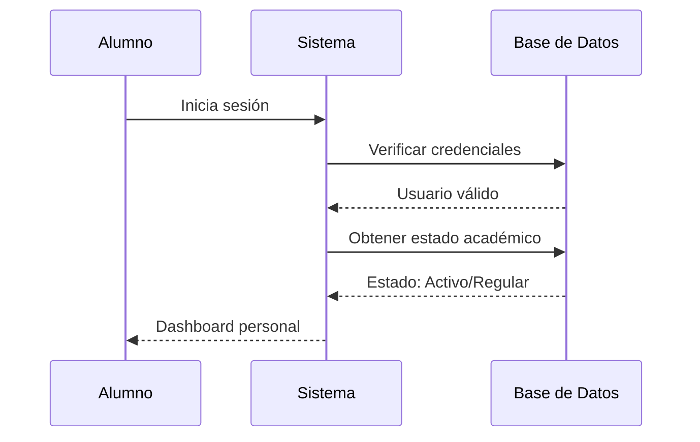

**Validaciones realizadas:**
- ✅ Credenciales válidas
- ✅ Usuario en estado "Activo"
- ✅ Sin bloqueos administrativos
- ✅ Período de inscripción abierto

**Excepciones manejadas:**
- ❌ Credenciales inválidas → Error de autenticación
- ❌ Usuario inactivo → Bloqueo con mensaje institucional
- ❌ Período cerrado → Mensaje de fechas de inscripción

---

#### **📚 Paso 2: Selección de Materias**
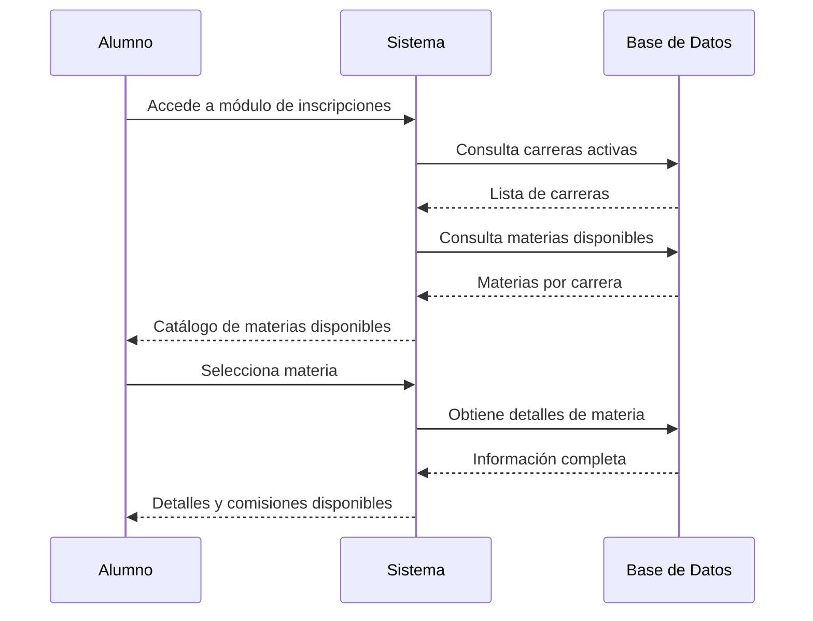

**Validaciones realizadas:**
- ✅ Alumno regular académicamente
- ✅ Carrera activa y vigente
- ✅ Materias disponibles en período actual
- ✅ Comisiones con cupos disponibles

**Información mostrada:**
- 📋 Materias correlativas aprobadas
- 📋 Materias pendientes de regularidad
- 📋 Comisiones disponibles con horarios
- 📋 Docentes asignados a cada comisión
- 📋 Cupos restantes por comisión

---

#### **🔍 Paso 3: Validación de Correlatividades**
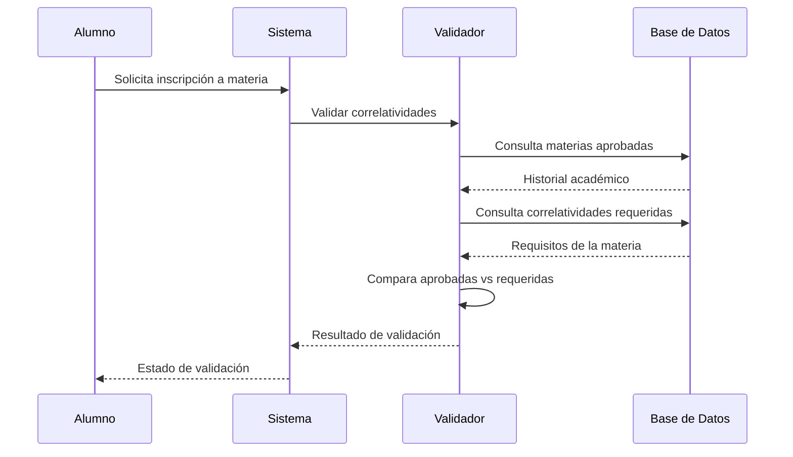

**Validaciones realizadas:**
- ✅ Correlatividades aprobadas (materias previas)
- ✅ Regularidad de cursadas anteriores
- ✅ No duplicación de inscripciones
- ✅ Orden progresivo de materias

**Casos especiales manejados:**
- 🔄 **Equivalencias**: Materias equivalentes aceptadas
- 🔄 **Correlatividades paralelas**: Permitidas simultáneamente
- 🔄 **Excepciones administrativas**: Autorización especial

**Mensajes según resultado:**
- ✅ "Correlatividades cumplidas"
- ❌ "Falta aprobar: [lista de materias]"
- ⚠️ "Correlatividades en proceso de validación"

---

#### **💰 Paso 4: Validación de Estado Financiero**
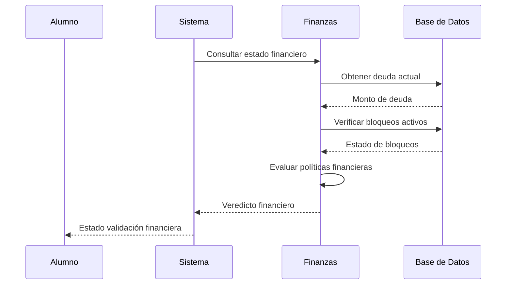

**Validaciones realizadas:**
- ✅ Estado financiero "Al Día"
- ✅ Deuda por debajo de umbral permitido
- ✅ Sin pagos vencidos
- ✅ Plan de pago vigente (si aplica)

**Políticas financieras:**
- 📊 **Umbral de bloqueo**: $X de deuda máxima
- 📊 **Período de gracia**: Días permitidos con deuda
- 📊 **Becas activas**: Descuentos aplicados automáticamente
- 📊 **Planes de pago**: Permisos especiales con acuerdos

**Mensajes según resultado:**
- ✅ "Estado financiero regular"
- ❌ "Bloqueado por deuda: $monto"
- ⚠️ "Contactar Secretaría Financiera"

---

#### **📊 Paso 5: Validación de Cupos y Disponibilidad**
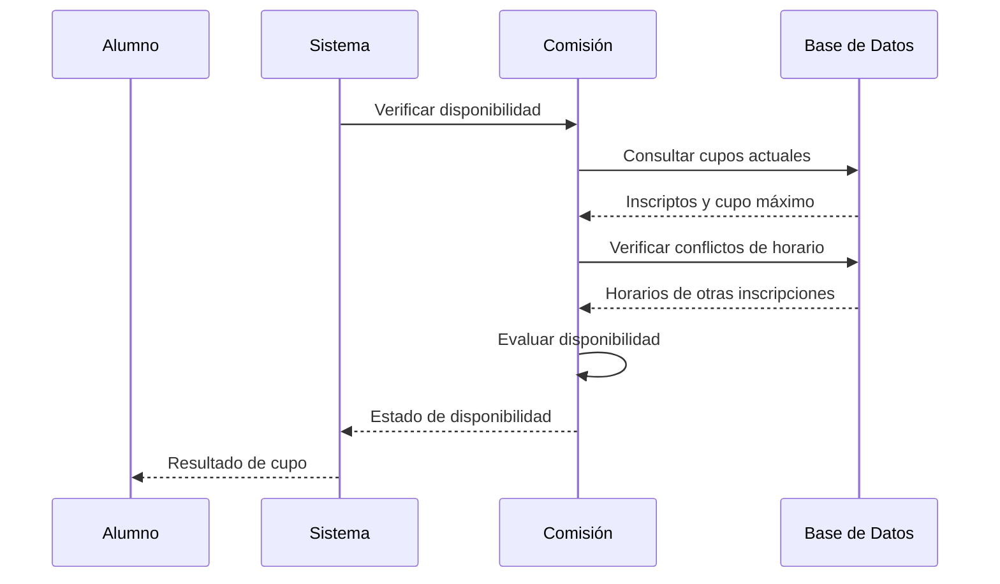

**Validaciones realizadas:**
- ✅ Cupo disponible en comisión seleccionada
- ✅ Sin superposición de horarios
- ✅ Período lectivo abierto
- ✅ Comisión activa y no cancelada

**Lógica de cupos:**
- 📊 **Cupo dinámico**: Puede aumentar por decisiones administrativas
- 📊 **Listas de espera**: Manejo automático de excedentes
- 📊 **Prioridades**: Porcentaje de avance en carrera
- 📊 **Reservas temporales**: Cupo reservado por X minutos

**Mensajes según resultado:**
- ✅ "Cupo disponible"
- ❌ "Cupo agotado en comisión"
- ❌ "Conflicto de horario con [materia]"
- ⚠️ "Últimos cupos disponibles"

---

#### **✅ Paso 6: Confirmación de Inscripción**
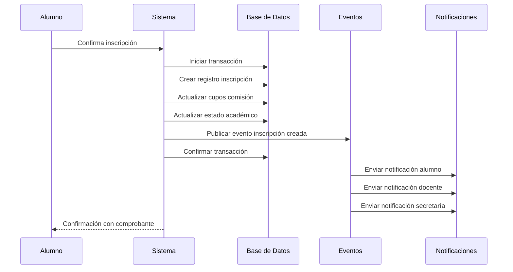

**Procesos ejecutados:**
- ✅ Creación de registro de inscripción
- ✅ Actualización de contador de cupos
- ✅ Registro en historial académico
- ✅ Generación de comprobante digital
- ✅ Disparo de eventos de dominio

**Notificaciones enviadas:**
- 📧 **Alumno**: Confirmación con detalles
- 📧 **Docente**: Lista de alumnos inscritos
- 📧 **Secretaría**: Registro administrativo
- 📧 **Sistema**: Logs y auditoría

**Comprobante generado:**
- 📄 **Número de inscripción**: Identificador único
- 📄 **Fecha y hora**: Timestamp de confirmación
- 📄 **Datos de comisión**: Horario, aula, docente
- 📄 **Código QR**: Validación móvil

---

### **⚠️ Manejo de Excepciones y Casos Especiales**

#### **🔄 Inscripción Condicional**
- **Situación**: Alumno con alguna correlativa en proceso
- **Solución**: Inscripción condicional sujeta a aprobación
- **Flujo**: Inscripción → Validación manual → Confirmación/Rechazo

#### **🔄 Cambio de Comisión**
- **Situación**: Alumno desea cambiar de comisión
- **Solución**: Proceso de cambio con validación de cupos
- **Flujo**: Solicitud → Validación → Baja anterior → Nueva inscripción

#### **🔄 Baja de Inscripción**
- **Situación**: Alumno solicita darse de baja
- **Solución**: Proceso de baja con plazos y penalidades
- **Flujo**: Solicitud → Validación plazos → Procesamiento → Liberación cupo

---

## 📝 **Flujo de Exámenes Finales**

### **🎯 Objetivo del Flujo**
Gestionar el proceso completo de exámenes finales, desde la programación de mesas hasta la generación de actas oficiales, con control de tribunales y validación automática de requisitos.

### **👥 Actores Involucrados**
- **Secretaría Académica**: Programa mesas y asigna tribunales
- **Docentes**: Forman parte de tribunales y cargan notas
- **Alumnos**: Se inscriben y rinden exámenes
- **Sistema**: Automatiza validaciones y procesos

---

### **🔄 Flujo Detallado Paso a Paso**

#### **🗓️ Paso 1: Programación de Mesas de Examen**
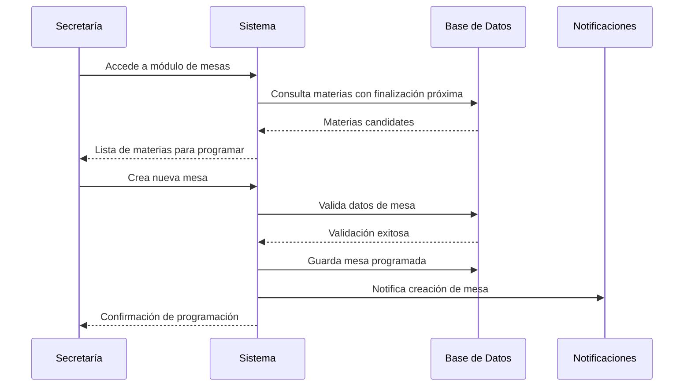

**Validaciones realizadas:**
- ✅ Materias con cursadas finalizando
- ✅ Período lectivo finalizado
- ✅ Disponibilidad de docentes
- ✅ Disponibilidad de aulas y recursos

**Datos requeridos:**
- 📋 **Materia**: Selección de materia
- 📋 **Fecha y hora**: Programación temporal
- 📋 **Tribunal**: Presidente y vocales
- 📋 **Aula**: Ubicación física
- 📋 **Recursos**: Equipamiento necesario

---

#### **📋 Paso 2: Inscripción a Mesas de Examen**
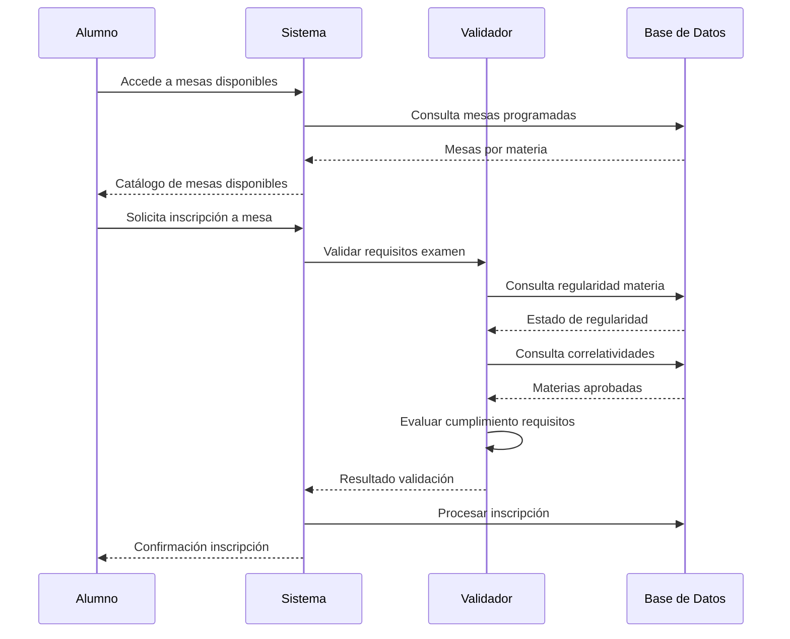

**Validaciones realizadas:**
- ✅ Regularidad en la cursada de la materia
- ✅ Correlatividades aprobadas
- ✅ Sin deuda bloqueante (si aplica)
- ✅ Cupo disponible en mesa
- ✅ Sin superposición con otros exámenes

**Estados de inscripción:**
- 📝 **Inscripto**: Confirmación exitosa
- 📝 **Pendiente**: Esperando validación manual
- 📝 **Rechazado**: Requisitos no cumplidos
- 📝 **Cancelado**: Baja por alumno o administración

---

#### **📝 Paso 3: Rendición de Examen**
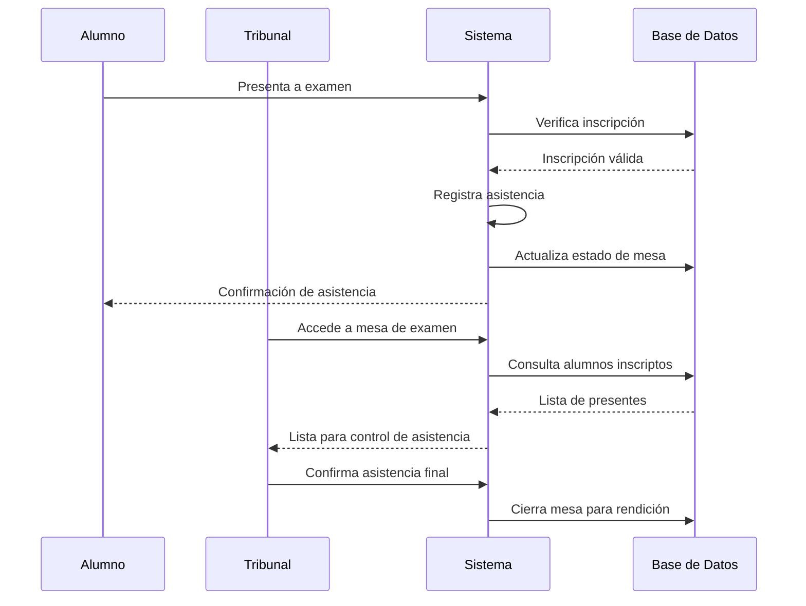

**Procesos durante examen:**
- ✅ Control de identidad de alumnos
- ✅ Registro de asistencia
- ✅ Distribución de materiales
- ✅ Control de tiempo y condiciones
- ✅ Manejo de incidentes

**Casos especiales:**
- 🔄 **Inasistencia justificada**: Certificados médicos
- 🔄 **Abandono de examen**: Registro y consecuencias
- 🔄 **Irregularidades**: Protocolo de manejo

---

#### **📊 Paso 4: Carga de Notas**
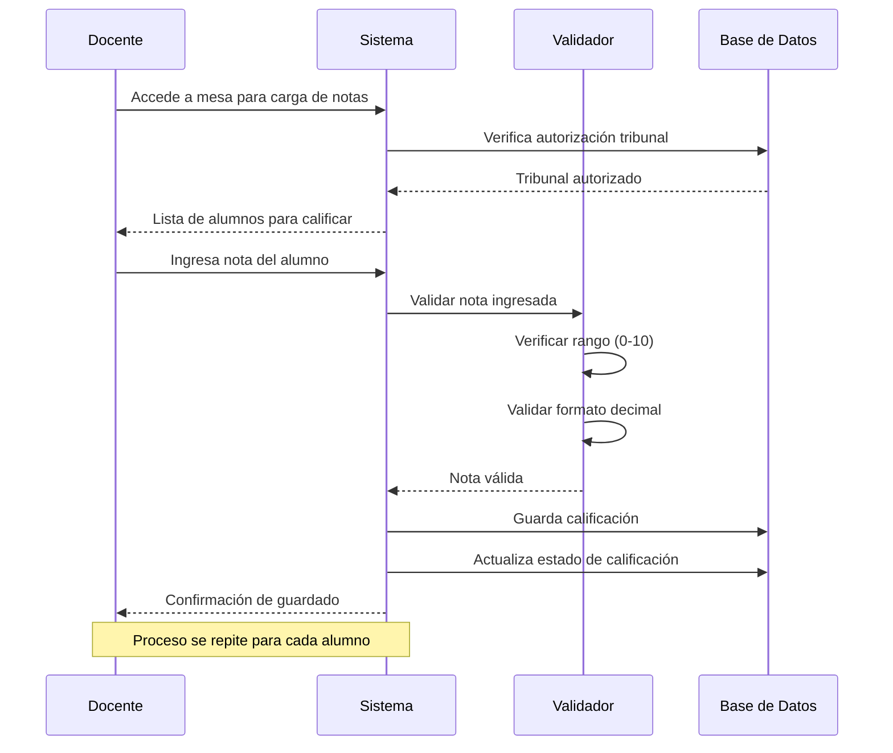

**Validaciones de notas:**
- ✅ Rango válido (0 a 10 puntos)
- ✅ Formato decimal correcto (máximo 2 decimales)
- ✅ Autorización del tribunal
- ✅ Mesa en estado "Para calificación"

**Estados de calificación:**
- 📊 **Borrador**: Nota ingresada sin confirmar
- 📊 **Confirmada**: Nota validada y guardada
- 📊 **Modificada**: Cambio posterior con justificación
- 📊 **Final**: Nota cerrada para acta

**Cálculos automáticos:**
- 📈 **Promedio de mesa**: Promedio de todos los alumnos
- 📈 **Porcentaje de aprobación**: Alumnos con nota ≥ 6
- 📈 **Estadísticas**: Distribución de notas

---

#### **📜 Paso 5: Generación de Actas**
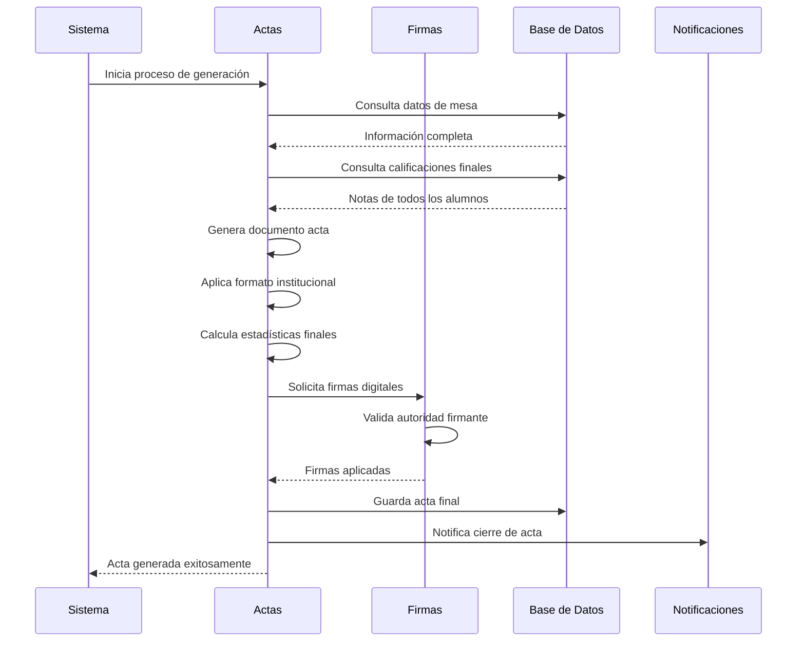

**Proceso de generación:**
- ✅ Recopilación de todos los datos
- ✅ Aplicación de formato oficial institucional
- ✅ Cálculo de estadísticas y promedios
- ✅ Incorporación de firmas digitales
- ✅ Validación de integridad y completitud

**Componentes del acta:**
- 📋 **Encabezado**: Datos institucionales y de mesa
- 📋 **Tribunal**: Nombres y firmas de presidente y vocales
- 📋 **Lista de alumnos**: Datos personales y calificaciones
- 📋 **Estadísticas**: Promedios y porcentajes
- 📋 **Pie de página**: Fecha y sellos institucionales

**Estados del acta:**
- 📜 **Borrador**: Generada sin firmar
- 📜 **En revisión**: Esperando validación
- 📜 **Firmada**: Con firmas del tribunal
- 📜 **Archivada**: Guardada definitivamente

---

### **⚠️ Manejo de Excepciones y Casos Especiales**

#### **🔄 Mesa Anulada**
- **Situación**: Cancelación por falta de cupo o recursos
- **Solución**: Reasignación automática o reprogramación
- **Notificaciones**: A todos los inscriptos

#### **🔄 Revisión de Notas**
- **Situación**: Alumno solicita revisión de calificación
- **Solución**: Proceso formal de revisión con tribunal
- **Plazos**: Períodos establecidos institucionalmente

#### **🔄 Acta Rectificativa**
- **Situación**: Detección de errores en acta final
- **Solución**: Generación de acta rectificativa
- **Proceso**: Autorización y registro de cambios

---

## 📊 **Flujos Adicionales Importantes**

### **💳 Flujo de Pagos**
1. **Generación de cuota** → Sistema crea automáticamente
2. **Notificación al alumno** → Email/SMS con vencimiento
3. **Procesamiento de pago** → Múltiples medios disponibles
4. **Actualización de estado** → Deuda y bloqueos financieros
5. **Generación de comprobante** → PDF con validez fiscal

### **📊 Flujo de Reportes**
1. **Solicitud de reporte** → Usuario selecciona tipo y parámetros
2. **Consulta de datos** → Sistema procesa información
3. **Generación de documento** → Formato seleccionado (PDF/Excel)
4. **Validación de permisos** → Control de acceso a información
5. **Entrega de resultado** → Descarga o envío automático

---

## 🔄 **Integración entre Flujos**

### **🔗 Conexiones Críticas**
- **Inscripciones → Finanzas**: Bloqueos automáticos por deuda
- **Exámenes → Académico**: Actualización de estados finales
- **Pagos → Inscripciones**: Liberación de bloqueos financieros
- **Asistencia → Regularidad**: Cálculo automático de estados

### **📊 Sincronización de Datos**
- **Eventos de dominio**: Comunicación entre módulos
- **Transacciones atómicas**: Consistencia de datos
- **Auditoría completa**: Registro de todas las operaciones
- **Rollback automático**: Reversión ante errores críticos

---

## 🎯 **Métricas y KPIs de Flujo**

### **📈 Indicadores de Eficiencia**
- **Tiempo de inscripción**: < 3 minutos por proceso
- **Tasa de errores**: < 2% en validaciones automáticas
- **Satisfacción usuarios**: > 4.5/5 estrellas
- **Disponibilidad**: > 99.5% uptime

### **📊 Indicadores de Negocio**
- **Tasa de inscripciones**: Porcentaje vs capacidad total
- **Tasa de aprobación**: Porcentaje de exámenes aprobados
- **Eficiencia de cobro**: Porcentaje de pagos en término
- **Adopción del sistema**: Porcentaje de usuarios activos

---

*Esta documentación de flujos sirve como guía de referencia para todos los procesos del sistema, asegurando consistencia y calidad en la ejecución de las operaciones institucionales.*
