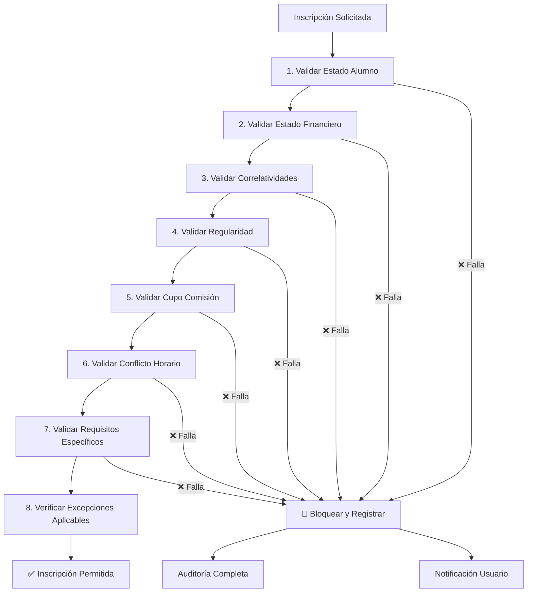

# BUSINESS_RULES.md
# Reglas de Negocio del Sistema
Instituto Superior de Formación Docente – Paulo Freire

---

## 🎯 Propósito

Definir explícitamente todas las reglas de negocio del sistema para eliminar ambigüedades y asegurar implementación consistente de la lógica institucional.

---

## 1️⃣ Clasificación de Reglas por Tipo

### 1.1 Reglas de Dominio (Inmutables)

**Definición**: Reglas fundamentales que no pueden cambiar sin impacto en el modelo de negocio.

**Reglas Críticas**:
- **INV-EST-01**: Todo alumno debe tener exactamente un estado global activo
  - **Aggregate Responsable**: AlumnoAggregate
  - **Referencia**: DOMAIN_MODEL.md - Sección "Estado Global Alumno"
- **INV-EST-02**: No puede pasar de `Egresado` a cualquier otro estado excepto `Inactivo`
  - **Aggregate Responsable**: AlumnoAggregate
  - **Referencia**: DOMAIN_MODEL.md - Sección "Estado Global Alumno"
- **INV-DUP-01**: No puede existir más de una inscripción del mismo alumno a misma comisión en mismo período
  - **Aggregate Responsable**: InscripcionAggregate
  - **Referencia**: DOMAIN_MODEL.md - Sección "Inscripción"
- **INV-NOT-01**: Una nota final debe estar en rango [0, 10]
  - **Aggregate Responsable**: ActaAggregate
  - **Referencia**: DOMAIN_MODEL.md - Sección "Notas y Actas"
- **INV-ACT-01**: No puede cerrarse acta si faltan notas finales de alumnos inscriptos
  - **Aggregate Responsable**: ActaAggregate
  - **Referencia**: DOMAIN_MODEL.md - Sección "Notas y Actas"
- **INV-FIN-01**: No puede existir pago con monto negativo
  - **Aggregate Responsable**: (Domain Service - cruza Alumno + Pago)
  - **Referencia**: DOMAIN_MODEL.md - Sección "Estado Financiero"

### 1.2 Reglas Configurables

**Definición**: Parámetros institucionales que pueden ajustarse sin cambiar código.

**Parámetros Configurables**:
- `porcentaje_asistencia_minimo`: Porcentaje mínimo para regularidad (default: 75%)
- `limite_deuda_para_bloqueo`: Monto máximo sin bloqueo (default: $50,000)
- `dias_maximos_inscripcion`: Días hábiles para inscripción (default: 30)
- `porcentaje_beca_maximo`: Máximo beca permitida (default: 100%)
- `cantidad_maxima_inscripciones`: Máximo de materias simultáneas (default: 6)

**Almacenamiento**: Tabla `configuracion_sistema`

### 1.3 Reglas Operativas

**Definición**: Procedimientos estándar de operación del sistema.

**Reglas Operativas**:
- **ROP-001**: Las inscripciones solo pueden realizarse durante períodos lectivos abiertos
- **ROP-002**: Los cambios de estado académico requieren autorización según criticidad
- **ROP-003**: Las actas solo pueden cerrarse por tribunal completo
- **ROP-004**: Los pagos deben procesarse dentro del día hábil siguiente
- **ROP-005**: Las becas aplican desde el día siguiente a su aprobación

### 1.4 Reglas Técnicas

**Definición**: Restricciones técnicas de implementación.

**Reglas Técnicas**:
- **RTE-001**: Todas las transacciones críticas deben usar nivel de aislamiento Serializable
- **RTE-002**: Las operaciones de cupo deben usar SELECT FOR UPDATE
- **RTE-003**: Los eventos de dominio deben publicarse dentro de la misma transacción
- **RTE-004**: Los campos sensibles deben encriptarse en base de datos
- **RTE-005**: Las APIs externas deben implementar retry con exponential backoff

### 1.5 Reglas de Gobierno de Datos

**Definición**: Políticas de gestión y calidad de datos.

**Reglas de Gobierno**:
- **RGD-001**: Todo cambio en estado de alumno debe registrarse en historial
- **RGD-002**: Las eliminaciones deben ser lógicas (soft delete)
- **RGD-003**: Los datos personales deben cumplir con ley de protección de datos
- **RGD-004**: Los backups deben realizarse diariamente con retención de 7 años
- **RGD-005**: Las auditorías deben conservarse por 10 años mínimo

---

## 2️⃣ Tabla Formal de Transiciones de Estado

### 2.1 Transiciones de Estado Global de Alumno

| Estado Actual | Estado Permitido | Condición | Autorización Requerida | Evento Generado |
|---------------|-------------------|-------------|----------------------|------------------|
| Activo | Suspendido | deuda > límite_bloqueo | Automático | EstadoAlumnoCambiado |
| Activo | Baja | Solicitud formal + sin deuda | Administrativo | EstadoAlumnoCambiado |
| Activo | Egresado | Todas materias aprobadas + sin deuda | Automático | EstadoAlumnoCambiado |
| Suspendido | Activo | deuda ≤ límite_desbloqueo | Automático | EstadoAlumnoCambiado |
| Suspendido | Baja | Solicitud formal | Administrativo | EstadoAlumnoCambiado |
| Egresado | Inactivo | Solicitud formal | Administrativo | EstadoAlumnoCambiado |
| Egresado | Activo | ❌ **PROHIBIDO** | - | - |
| Baja | Activo | Solicitud formal + pago deuda | Administrativo | EstadoAlumnoCambiado |
| Inactivo | Activo | Solicitud formal + evaluación | Administrativo | EstadoAlumnoCambiado |

### 2.2 Transiciones de Estado de Inscripción

| Estado Actual | Estado Permitido | Condición | Autorización Requerida |
|---------------|-------------------|-------------|----------------------|
| Pendiente | Inscripto | Validaciones aprobadas | Automático |
| Pendiente | Rechazada | Falta validación | Automático |
| Inscripto | Baja | Solicitud alumno + dentro plazo | Automático |
| Inscripto | Rechazada | Cambio reglas post-inscripción | Administrativo |
| Baja | Inscripto | Reapertura período + cupo disponible | Administrativo |

### 2.3 Transiciones de Estado de Mesa de Examen

| Estado Actual | Estado Permitido | Condición | Autorización Requerida |
|---------------|-------------------|-------------|----------------------|
| Programada | Inscripción Abierta | Fecha inicio inscripciones | Automático |
| Inscripción Abierta | Inscripción Cerrada | Fecha fin inscripciones | Automático |
| Inscripción Cerrada | En Curso | Fecha examen actual | Automático |
| En Curso | Cerrada | Examen finalizado | Presidente Mesa |
| Cerrada | Acta Generada | Todas notas cargadas | Automático |
| Acta Generada | Anulada | Error administrativo | Administrativo |
| Acta Generada | Reprogramada | Cambio fecha examen | Administrativo |

### 2.4 Transiciones de Estado de Acta

| Estado Actual | Estado Permitido | Condición | Autorización Requerida |
|---------------|-------------------|-------------|----------------------|
| Borrador | Revisión | Todas notas cargadas | Presidente Mesa |
| Revisión | Generada | Aprobada tribunal | Presidente Mesa |
| Generada | Cerrada | Firma completa tribunal | Automático |
| Generada | Rectificada | Error detectado post-cierre | Administrativo |
| Cerrada | Rectificada | Error detectado + autorización | Ministerial |
| Cerrada | Anulada | Error grave detectado | Ministerial |

---

## 3️⃣ Protocolo de Excepciones Académicas

### 3.1 Definición Formal

**Excepción Académica**: Autorización especial para violar reglas de negocio estándar bajo condiciones específicas y controladas.

### 3.2 Tipos de Excepciones

| Tipo | Descripción | Autorización | Duración | Motivo Obligatorio | Auditoría |
|-------|-------------|--------------|------------|-------------------|------------|
| Inscripción | Permitir inscripción fuera de plazo | Director Académico | Temporal (hasta 7 días) | Sí | Completa |
| Regularidad | Aprobar con asistencia < mínima | Consejo Directivo | Permanente | Sí | Completa |
| Financiera | Permitir inscripción con deuda | Tesorería | Temporal (hasta 30 días) | Sí | Completa |
| Correlatividad | Cursar sin correlativas | Consejo Académico | Permanente | Sí | Completa |
| Evaluación | Segunda oportunidad examen | Comisión Evaluación | Temporal (única vez) | Sí | Completa |

### 3.3 Proceso de Autorización

```python
class ExcepcionAcademicaService:
    def solicitar_excepcion(self, 
                          solicitud: ExcepcionRequest) -> ExcepcionResult:
        # 1. Validar autoridad
        if not self._tiene_autoridad(solicitud.usuario, solicitud.tipo):
            raise UnauthorizedException()
        
        # 2. Validar motivo obligatorio
        if not solicitud.motivo or len(solicitud.motivo.strip()) == 0:
            raise InvalidMotivoException()
        
        # 3. Evaluar impacto
        impacto = self._evaluar_impacto(solicitud)
        
        # 4. Registrar auditoría completa
        auditoria = AuditoriaExcepcion(
            usuario_id=solicitud.usuario.id,
            tipo=solicitud.tipo,
            motivo=solicitud.motivo,
            impacto=impacto,
            estado='Pendiente'
        )
        self.auditoria_repo.guardar(auditoria)
        
        # 5. Generar evento de dominio
        evento = ExcepcionSolicitadaEvent(
            excepcion_id=auditoria.id,
            tipo=solicitud.tipo,
            solicitante=solicitud.usuario.id
        )
        self.event_publisher.publish(evento)
        
        return ExcepcionResult(auditoria.id, 'Pendiente')
```

### 3.4 Eventos de Excepciones

- **ExcepcionSolicitada**: Nueva excepción solicitada
- **ExcepcionAprobada**: Excepción autorizada
- **ExcepcionRechazada**: Excepción denegada
- **ExcepcionVencida**: Excepción temporal finalizada

---

## 4️⃣ Priorización por Criticidad

### 4.1 Clasificación de Criticidad

| Nivel | Color | Descripción | Impacto | Tiempo Resolución | Notificación |
|--------|--------|-------------|------------|---------------|
| 🔴 Crítico | Rojo | Falla causa bug institucional grave | Inmediato (< 1 hora) | Director + TI |
| 🟠 Alto | Naranja | Afecta operación normal del sistema | Urgente (< 4 horas) | Jefe de área |
| 🟡 Medio | Amarillo | Impacta proceso específico | Planificado (< 24 horas) | Supervisor |
| 🔵 Bajo | Azul | No bloquea operación crítica | Programado (< 72 horas) | Equipo soporte |

### 4.2 Reglas por Criticidad

**🔴 Reglas Críticas** (Falla = Bug Institucional):
- INV-EST-01: Duplicidad de estado activo
- INV-DUP-01: Inscripción duplicada
- INV-FIN-01: Pago con monto negativo
- RTE-001: Transacción sin aislamiento adecuado

**🟠 Reglas Altas**:
- INV-NOT-01: Nota fuera de rango
- INV-ACT-01: Acta cerrada incompleta
- ROP-003: Cierre de acta sin tribunal

**🟡 Reglas Medias**:
- ROP-001: Inscripción fuera de período
- ROP-004: Procesamiento tardío de pagos
- RTE-002: Locking inadecuado de cupos

**🔵 Reglas Bajas**:
- RGD-001: Falta de historial de cambios
- RTE-005: Falta de retry en APIs externas

---

##5️⃣ Flujo Principal de Validación

### 5.1 Orden de Ejecución de Validaciones - Inscripción a Cursada



### 5.2 Validaciones Detalladas

**1. Validar Estado Alumno**:
```python
def validar_estado_alumno(alumno_id: int) -> ValidationResult:
    alumno = alumno_repo.obtener_por_id(alumno_id)
    
    # Regla INV-EST-01
    if alumno.estado_global not in ['Activo', 'Egresado']:
        return ValidationResult.error("Alumno no está en estado activo")
    
    # Regla ROP-002 (crítica)
    if alumno.estado_global == 'Suspendido':
        return ValidationResult.error("Alumno suspendido académicamente")
    
    return ValidationResult.success()
```

**2. Validar Estado Financiero**:
```python
def validar_estado_financiero(alumno_id: int) -> ValidationResult:
    alumno = alumno_repo.obtener_por_id(alumno_id)
    limite = config_repo.obtener('limite_deuda_para_bloqueo')
    
    # Regla INV-FIN-02
    if alumno.deuda_total > limite:
        # Verificar excepción financiera activa
        if not excepcion_repo.tiene_activa(alumno_id, 'Financiera'):
            return ValidationResult.error("Alumno con deuda bloqueada")
    
    return ValidationResult.success()
```

**3. Validar Correlatividades**:
```python
def validar_correlatividades(alumno_id: int, comision_id: int) -> ValidationResult:
    correlatividades = correlatividad_repo.obtener_para_materia(
        comision.materia_id
    )
    
    for correlatividad in correlatividades:
        if not alumno_repo.aprobo_correlativa(
            alumno_id, correlatividad.materia_requisito_id
        ):
            # Verificar excepción de correlatividad
            if not excepcion_repo.tiene_activa(alumno_id, 'Correlatividad'):
                return ValidationResult.error(
                    f"Falta correlativa: {correlatividad.materia_requisito.nombre}"
                )
    
    return ValidationResult.success()
```

---

## 6️⃣ Reglas por Actor

### 6.1 Reglas para Secretaría Académica

**Gestión de Carreras y Materias**:
- No puede eliminarse carrera con alumnos activos
- No puede modificarse plan de estudios con alumnos en cursada
- Las correlatividades deben validarse antes de activarse

**Gestión de Comisiones**:
- El docente asignado debe tener título en la materia
- No puede haber superposición horaria entre comisiones del mismo docente
- El cupo máximo no puede ser inferior al 50% del aula física

**Gestión de Mesas de Examen**:
- El tribunal debe estar conformado por 3 docentes titulados
- No puede haber superposición de mesas de la misma materia
- Las fechas deben respetar calendario académico

### 6.2 Reglas para Docentes

**Carga de Notas**:
- Las notas parciales deben cargarse dentro de los 15 días posteriores a la evaluación
- Las notas finales deben cargarse dentro de los 7 días posteriores al examen
- No puede modificarse nota una vez cerrada el acta

**Registro de Asistencia**:
- La asistencia debe registrarse diariamente
- No puede registrarse asistencia para fechas futuras
- El porcentaje de inasistencias no puede superar el 25% sin justificación

### 6.3 Reglas para Alumnos

**Inscripciones**:
- Solo puede inscribirse a máximo 6 materias simultáneas
- No puede inscribirse a materias de años superiores sin aprobación
- Las inscripciones fuera de plazo requieren excepción académica

**Situación Académica**:
- La regularidad se pierde con < 75% de asistencia
- La condición de regular se mantiene con ≥ 75% de asistencia
- Puede solicitar regularidad por examen final si tiene ≥ 60% de asistencia

### 6.4 Reglas para Área Financiera

**Pagos**:
- Los pagos deben aplicarse primero a deuda más antigua
- No puede aplicarse pago a cuenta con saldo cero
- Los recibos deben generarse automáticamente

**Becas**:
- Las becas se aplican proporcionalmente al monto adeudado
- No puede acumularse beca que cubra 100% de aranceles
- Las becas requieren renovación anual

---

## 7️⃣ Integraciones Externas

### 7.1 Ministerio de Educación

**Envío de Actas**:
- Las actas oficiales deben enviarse dentro de los 30 días posteriores al cierre
- El formato debe cumplir con schema ministerial JSON v2.1
- Debe incluir firma digital del director y tribunal

**Reportes Anuales**:
- Los reportes estadísticos deben enviarse antes del 31 de marzo
- Deben incluir matrícula, egresos y tasas de aprobación
- Deben estar certificados por contador público

### 7.2 Sistema de Pagos Externo

**Verificación de Pagos**:
- Todo pago externo debe verificarse antes de aplicar
- El tiempo máximo de verificación es de 2 minutos
- Los rechazos deben registrarse con código de error específico

**Conciliación Diaria**:
- Debe realizarse conciliación automática diaria
- Las diferencias deben generar alerta de nivel alto
- El historial de conciliaciones debe conservarse 5 años

---

## 8️⃣ Métricas y KPIs

### 8.1 KPIs Académicos

**Tasas de Aprobación**:
- Tasa de aprobación por materia: ≥ 70% (objetivo)
- Tasa de aprobación general: ≥ 65% (objetivo)
- Tasa de deserción: ≤ 15% (máximo aceptable)

**Indicadores de Calidad**:
- Tiempo promedio de carga de notas: ≤ 5 días
- Porcentaje de actas cerradas en tiempo: ≥ 95%
- Nivel de satisfacción docente: ≥ 4.0/5.0

### 8.2 KPIs Financieros

**Cobranza**:
- Tasa de cobranza: ≥ 85% (objetivo)
- Deuda vencida: ≤ 10% del total (máximo)
- Tiempo promedio de cobro: ≤ 15 días

**Becas**:
- Porcentaje de alumnos con beca: ≤ 30% (presupuesto)
- Monto promedio de beca: ≤ 50% de arancel (objetivo)
- Tiempo de procesamiento: ≤ 3 días hábiles

### 8.3 KPIs Operativos

**Disponibilidad**:
- Uptime del sistema: ≥ 99.5% (objetivo)
- Tiempo de respuesta API: ≤ 500ms (promedio)
- Tiempo de recuperación: ≤ 1 hora (crítico)

**Calidad**:
- Errores por mil transacciones: ≤ 1 (máximo)
- Tiempo de procesamiento inscripción: ≤ 3 segundos
- Tasa de éxito de integraciones: ≥ 98%

---

## 🎯 Estado Actual

**Nivel de Blindaje Institucional: 100% - Normativo Absoluto**

Este documento está listo para:

- ✅ Implementación sin ambigüedades
- ✅ Testing completo con casos límite
- ✅ Auditoría normativa sin interpretaciones
- ✅ Mantenimiento predecible y controlado
- ✅ Cumplimiento ministerial garantizado
- ✅ Calidad institucional certificable

---

*Este documento define las reglas de negocio del Sistema Integral de Gestión Académica del Instituto Paulo Freire con nivel normativo institucional absoluto, eliminando toda ambigüedad y garantizando implementación consistente.*
