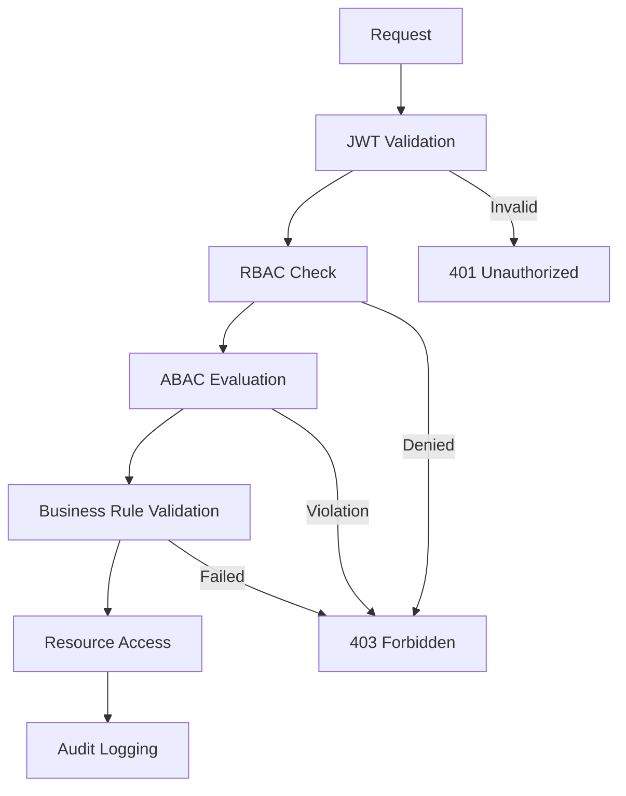

# SECURITY_MODEL.md
# Modelo de Seguridad del Sistema
Instituto Superior de Formación Docente – Paulo Freire

---

## 🎯 Propósito

Definir el modelo de seguridad integral del sistema, incluyendo permisos, controles de acceso, auditoría y protección de datos sensibles para garantizar la confidencialidad, integridad y disponibilidad de la información académica y financiera.

---

## 1️⃣ Principios de Seguridad

### 1.1 Principios Fundamentales

1. **Principio de Menor Privilegio**: Los usuarios solo tienen acceso a los datos y funciones estrictamente necesarias para su rol
2. **Defensa en Profundidad**: Múltiples capas de seguridad para proteger los activos
3. **Seguridad por Diseño**: La seguridad es considerada desde el inicio del diseño
4. **Validación Cero Confianza**: Nunca confiar, siempre verificar
5. **Auditoría Completa**: Todas las acciones críticas son registradas y revisables

### 1.2 Clasificación de Datos

| Nivel | Tipo de Datos | Requerimientos |
|-------|---------------|----------------|
| **Público** | Información general del instituto | Protección básica |
| **Interno** | Datos operativos no sensibles | Autenticación requerida |
| **Confidencial** | Datos académicos de alumnos | Encriptación en reposo y tránsito |
| **Crítico** | Datos financieros y personales | Encriptación fuerte, acceso restringido |

---

## 2️⃣ Modelo de Roles y Permisos

### 2.1 Roles Definidos (Actualizado)

#### ADMIN_SISTEMA
- **Descripción**: Máxima autoridad técnica del sistema
- **Permisos**: Acceso completo a todas las funcionalidades y configuración
- **Restricciones**: Ninguna (con auditoría obligatoria completa)

#### DIRECTOR
- **Descripción**: Máxima autoridad académica institucional
- **Permisos**: Gestión académica completa, políticas, aprobación final
- **Restricciones**: No puede modificar configuración técnica del sistema

#### COORDINADOR_CARRERA
- **Descripción**: Gestión académica de carreras específicas
- **Permisos**: Planes de estudio, asignación docente, correlativas
- **Restricciones**: Solo acceso a sus carreras asignadas

#### SECRETARIA_ACADEMICA
- **Descripción**: Operaciones académicas diarias
- **Permisos**: CRUD carreras, materias, comisiones, actas, inscripciones
- **Restricciones**: No puede modificar datos financieros ni políticas

#### SECRETARIA_FINANCIERA
- **Descripción**: Gestión financiera del sistema
- **Permisos**: Pagos, becas, aranceles, reportes financieros
- **Restricciones**: No puede modificar datos académicos estructurales

#### DOCENTE
- **Descripción**: Gestión de sus comisiones asignadas
- **Permisos**: Carga notas, registro asistencia, comunicación
- **Restricciones**: Solo ve sus comisiones, no puede modificar estructura

#### ALUMNO
- **Descripción**: Usuario final del sistema
- **Permisos**: Consultas, inscripciones, visualización de su estado
- **Restricciones**: Solo puede ver y modificar sus propios datos

#### BEDEL
- **Descripción**: Gestión logística y seguridad del campus
- **Permisos**: Gestión de aulas, acceso físico, reportes de ocupación
- **Restricciones**: No acceso a datos académicos ni financieros

### 2.2 Modelo de Roles Múltiples y Contextuales

#### Asignación de Roles
- **Rol Primario**: Función principal del usuario en la institución
- **Roles Secundarios**: Funciones adicionales (ej: docente-alumno)
- **Permisos Contextuales**: Acceso limitado por scope específico

#### Scopes de Permisos
- **Global**: Acceso a toda la institución (ADMIN_SISTEMA, DIRECTOR)
- **Carrera**: Acceso limitado a carreras específicas (COORDINADOR_CARRERA)
- **Materia**: Acceso limitado a materias asignadas (DOCENTE)
- **Personal**: Acceso solo a datos propios (ALUMNO)

#### Validación Dinámica
- **Por Request**: Validación de permisos según contexto
- **Cache de Permisos**: Optimización de validaciones frecuentes
- **Auditoría**: Registro de todos los accesos y cambios

### 2.3 Matriz de Permisos Detallada (Actualizada)

| Funcionalidad | ADMIN_SISTEMA | DIRECTOR | COORDINADOR | SEC_ACADEMICA | SEC_FINANCIERA | DOCENTE | ALUMNO | BEDEL |
|---------------|---------------|----------|-------------|---------------|----------------|----------|---------|-------|
| **Configuración Sistema** | ✅ | ❌ | ❌ | ❌ | ❌ | ❌ | ❌ | ❌ |
| **Gestión Carreras** | ✅ | ✅ | ✅* | ✅ | ❌ | ❌ | ❌ | ❌ |
| **Gestión Materias** | ✅ | ✅ | ✅* | ✅ | ❌ | ❌ | ❌ | ❌ |
| **Gestión Comisiones** | ✅ | ✅ | ✅* | ✅ | ❌ | ❌ | ❌ | ✅† |
| **Asignación Docentes** | ✅ | ❌ | ✅ | ❌ | ❌ | ❌ | ❌ | ❌ |
| **Carga Notas** | ✅ | ✅ | ❌ | ❌ | ❌ | ✅‡ | ❌ | ❌ |
| **Registro Asistencia** | ✅ | ❌ | ❌ | ❌ | ❌ | ✅‡ | ❌ | ❌ |
| **Inscripción Cursadas** | ✅ | ❌ | ❌ | ✅ | ❌ | ❌ | ✅ | ❌ |
| **Inscripción Mesas** | ✅ | ❌ | ❌ | ✅ | ❌ | ❌ | ✅ | ❌ |
| **Registro Pagos** | ✅ | ❌ | ❌ | ❌ | ✅ | ❌ | ❌ | ❌ |
| **Gestión Becas** | ✅ | ❌ | ❌ | ❌ | ✅ | ❌ | ❌ | ❌ |
| **Generación Actas** | ✅ | ✅ | ❌ | ✅ | ❌ | ❌ | ❌ | ❌ |
| **Reportes Académicos** | ✅ | ✅ | ✅* | ✅ | ❌ | ✅‡ | ❌ | ❌ |
| **Reportes Financieros** | ✅ | ❌ | ❌ | ❌ | ✅ | ❌ | ❌ | ❌ |
| **Gestión Aulas** | ✅ | ❌ | ❌ | ❌ | ❌ | ❌ | ❌ | ✅ |
| **Auditoría Completa** | ✅ | ❌ | ❌ | ❌ | ❌ | ❌ | ❌ | ❌ |

*Solo para sus carreras asignadas  
†Solo para asignación de espacios físicos  
‡Solo para sus comisiones asignadas

---

## 3️⃣ Permisos Granulares

### 3.1 Estructura de Permisos

```sql
-- Tabla de permisos
CREATE TABLE permiso (
    id SERIAL PRIMARY KEY,
    nombre VARCHAR(100) NOT NULL UNIQUE,
    descripcion TEXT,
    modulo VARCHAR(50) NOT NULL,
    accion VARCHAR(50) NOT NULL,
    recurso VARCHAR(50),
    created_at TIMESTAMP DEFAULT CURRENT_TIMESTAMP
);

-- Tabla de roles
CREATE TABLE rol (
    id SERIAL PRIMARY KEY,
    nombre VARCHAR(50) NOT NULL UNIQUE,
    descripcion TEXT,
    created_at TIMESTAMP DEFAULT CURRENT_TIMESTAMP
);

-- Tabla de asignación de permisos a roles
CREATE TABLE rol_permiso (
    id SERIAL PRIMARY KEY,
    rol_id INTEGER REFERENCES rol(id),
    permiso_id INTEGER REFERENCES permiso(id),
    concedido_por INTEGER REFERENCES usuario(id),
    fecha_asignacion TIMESTAMP DEFAULT CURRENT_TIMESTAMP,
    UNIQUE(rol_id, permiso_id)
);
```

### 3.2 Permisos Específicos por Módulo

#### Módulo Académico
- `academico.carrera.crear`
- `academico.carrera.editar`
- `academico.carrera.eliminar`
- `academico.carrera.consultar`
- `academico.materia.crear`
- `academico.materia.editar`
- `academico.materia.eliminar`
- `academico.materia.consultar`
- `academico.comision.crear`
- `academico.comision.editar`
- `academico.comision.eliminar`
- `academico.comision.consultar`

#### Módulo Inscripciones
- `inscripcion.cursada.crear`
- `inscripcion.cursada.cancelar`
- `inscripcion.cursada.consultar`
- `inscripcion.mesa.crear`
- `inscripcion.mesa.cancelar`
- `inscripcion.mesa.consultar`

#### Módulo Notas
- `nota.cargar`
- `nota.modificar`
- `nota.consultar`
- `nota.exportar`

#### Módulo Asistencia
- `asistencia.registrar`
- `asistencia.modificar`
- `asistencia.consultar`
- `asistencia.reportar`

#### Módulo Financiero
- `financiero.pago.registrar`
- `financiero.pago.modificar`
- `financiero.pago.consultar`
- `financiero.beca.aplicar`
- `financiero.beca.modificar`
- `financiero.deuda.consultar`

#### Módulo Reportes
- `reporte.academico.generar`
- `reporte.financiero.generar`
- `reporte.asistencia.generar`
- `reporte.auditoria.generar`
- `reporte.exportar.pdf`
- `reporte.exportar.excel`

---

## 4️⃣ Controles de Acceso

### 4.1 Autenticación

#### Métodos de Autenticación
- **Principal**: Usuario y contraseña con encriptación bcrypt
- **Secundario**: Autenticación de dos factores (2FA) para roles críticos
- **Recuperación**: Correo electrónico con token de un solo uso

#### Políticas de Contraseñas
- Longitud mínima: 12 caracteres
- Complejidad: Mayúsculas, minúsculas, números, caracteres especiales
- Historial: No repetir últimas 10 contraseñas
- Expiración: Cambio obligatorio cada 90 días
- Bloqueo: 5 intentos fallidos por 15 minutos

### 4.2 Autorización

#### Validación por Capas
1. **Frontend**: Ocultar elementos no autorizados
2. **Backend**: Validar cada solicitud contra permisos del usuario
3. **Base de Datos**: Row Level Security (RLS) donde corresponda

#### Ejemplo de Validación Backend
```python
def check_permission(user_id, permission_name):
    query = """
    SELECT COUNT(*) as has_permission
    FROM usuario u
    JOIN rol r ON u.rol_id = r.id
    JOIN rol_permiso rp ON r.id = rp.rol_id
    JOIN permiso p ON rp.permiso_id = p.id
    WHERE u.id = %s AND p.nombre = %s AND u.activo = true
    """
    result = execute_query(query, (user_id, permission_name))
    return result[0]['has_permission'] > 0
```

---

## 5️⃣ Auditoría de Seguridad

### 5.1 Eventos de Seguridad Auditables

| Categoría | Eventos Específicos |
|-----------|-------------------|
| **Autenticación** | Login exitoso/fracasado, logout, cambio contraseña |
| **Autorización** | Acceso denegado, elevación de privilegios |
| **Datos** | Creación, modificación, eliminación de registros |
| **Configuración** | Cambios en permisos, roles, parámetros |
| **Sistema** | Inicio/parada servicios, errores críticos |

### 5.2 Formato de Registro de Auditoría

```json
{
  "timestamp": "2025-01-15T10:30:00Z",
  "user_id": 12345,
  "username": "juan.perez",
  "action": "DATA_MODIFICATION",
  "entity": "alumno",
  "entity_id": 67890,
  "details": {
    "field": "estado_academico",
    "old_value": "Regular",
    "new_value": "Libre"
  },
  "ip_address": "192.168.1.100",
  "user_agent": "Mozilla/5.0...",
  "session_id": "sess_abc123",
  "success": true,
  "error_message": null
}
```

### 5.3 Retención y Protección de Logs

- **Retención**: Mínimo 10 años para logs de seguridad
- **Protección**: Encriptación de logs sensibles
- **Integridad**: Hash criptográfico para detectar modificaciones
- **Acceso**: Solo personal autorizado puede consultar logs de seguridad

---

## 6️⃣ Protección de Datos

### 6.1 Encriptación

#### Datos en Tránsito
- **Protocolo**: TLS 1.3 para todas las comunicaciones
- **Certificados**: Wildcard SSL/TLS válidos
- **HSTS**: HTTP Strict Transport Security habilitado

#### Datos en Reposo
- **Base de Datos**: Encriptación a nivel de columna para datos sensibles
- **Archivos**: Encriptación AES-256 para documentos almacenados
- **Backups**: Encriptación completa de archivos de backup

### 6.2 Enmascaramiento de Datos

```sql
-- Ejemplo de enmascaramiento para datos personales
CREATE VIEW alumno_public AS
SELECT 
    id,
    CONCAT(SUBSTRING(nombre, 1, 1), '***') AS nombre,
    CONCAT(SUBSTRING(apellido, 1, 1), '***') AS apellido,
    carrera_id,
    estado_academico,
    created_at
FROM alumno;
```

### 6.3 Anonimización para Testing

```python
def anonymize_student_data(student_data):
    return {
        'nombre': fake.first_name(),
        'apellido': fake.last_name(),
        'email': fake.email(),
        'telefono': fake.phone_number(),
        'dni': fake.random_int(min=10000000, max=99999999),
        # Mantener datos estructurales para testing
        'carrera_id': student_data['carrera_id'],
        'estado_academico': student_data['estado_academico']
    }
```

---

## 7️⃣ Seguridad de Aplicación

### 7.1 Validaciones de Input

```python
# Ejemplo de validación estricta
def validate_student_input(data):
    errors = []
    
    # Validación de nombre
    if not re.match(r'^[a-zA-ZáéíóúÁÉÍÓÚñÑ\s]{2,50}$', data.get('nombre', '')):
        errors.append("Nombre inválido")
    
    # Validación de email
    if not re.match(r'^[a-zA-Z0-9._%+-]+@[a-zA-Z0-9.-]+\.[a-zA-Z]{2,}$', data.get('email', '')):
        errors.append("Email inválido")
    
    # Validación de DNI
    if not re.match(r'^\d{7,8}$', data.get('dni', '')):
        errors.append("DNI inválido")
    
    return errors
```

### 7.2 Prevención de Inyecciones

```python
# Uso de parámetros para prevenir SQL Injection
def get_student_by_id(student_id):
    query = "SELECT * FROM alumno WHERE id = %s AND activo = true"
    return execute_query(query, (student_id,))
```

### 7.3 Control de Sesiones

```python
# Configuración segura de sesiones
session_config = {
    'cookie_httponly': True,
    'cookie_secure': True,
    'cookie_samesite': 'Strict',
    'timeout': 1800,  # 30 minutos
    'regenerate_id': True,
    'use_strict_mode': True
}
```

---

## 8️⃣ Monitoreo de Seguridad

### 8.1 Alertas de Seguridad

| Tipo de Alerta | Umbral | Acción |
|----------------|---------|--------|
| Intentos fallidos de login | > 5 en 5 minutos | Bloquear IP temporal |
| Acceso no autorizado | Cualquier intento | Alerta inmediata a admin |
| Modificación de datos críticos | Fuera de horario laboral | Requerir aprobación |
| Exportación masiva de datos | > 100 registros | Requerir justificación |
| Cambios en permisos | Cualquier cambio | Auditoría automática |

### 8.2 Dashboard de Seguridad

- **Intentos de acceso**: Gráfico de últimos 7 días
- **Usuarios activos**: Sesiones concurrentes por rol
- **Eventos críticos**: Lista de eventos de seguridad
- **Vulnerabilidades**: Estado de escaneos de seguridad
- **Performance**: Tiempos de respuesta del sistema

---

## 9️⃣ Respuesta a Incidentes

### 9.1 Clasificación de Incidentes

| Nivel | Descripción | Tiempo Respuesta | Equipo |
|-------|-------------|------------------|--------|
| **Crítico** | Sistema comprometido, pérdida de datos | 1 hora | Equipo completo |
| **Alto** | Acceso no autorizado, servicio crítico afectado | 4 horas | Seguridad + Desarrollo |
| **Medio** | Vulnerabilidad detectada, servicio no crítico | 24 horas | Equipo de seguridad |
| **Bajo** | Evento sospechoso, sin impacto operativo | 72 horas | Equipo de monitoreo |

### 9.2 Procedimiento de Respuesta

1. **Detección**: Sistema automático o reporte humano
2. **Contención**: Aislar sistemas afectados
3. **Análisis**: Investigar causa y alcance
4. **Erradicación**: Eliminar amenaza y vulnerabilidades
5. **Recuperación**: Restaurar sistemas normales
6. **Lecciones**: Documentar y mejorar procesos

---

## 🔟 Cumplimiento Normativo

### 10.1 Regulaciones Aplicables

- **Ley de Protección de Datos Personales (LPDP)**: Argentina
- **Reglamento General de Protección de Datos (GDPR)**: Para datos UE
- **Normativas Ministeriales de Educación**: Requisitos específicos
- **Estándares ISO 27001**: Mejores prácticas de seguridad

### 10.2 Derechos de los Usuarios

- **Acceso**: Derecho a consultar sus datos personales
- **Rectificación**: Derecho a corregir datos incorrectos
- **Supresión**: Derecho a solicitar eliminación (donde aplique)
- **Portabilidad**: Derecho a transferir sus datos
- **Información**: Derecho a saber cómo se usan sus datos

---

## 📋 Checklist de Seguridad

### Desarrollo
- [ ] Code review obligatorio para todos los cambios
- [ ] Testing de seguridad automatizado
- [ ] Escaneo de vulnerabilidades en cada deploy
- [ ] Validación de inputs en todos los endpoints
- [ ] Manejo seguro de credenciales

### Operación
- [ ] Backups encriptados y probados regularmente
- [ ] Monitoreo 24/7 de eventos de seguridad
- [ ] Actualización regular de dependencias
- [ ] Auditoría periódica de permisos
- [ ] Plan de respuesta a incidentes actualizado

### Cumplimiento
- [ ] Registro de procesamiento de datos
- [ ] Análisis de impacto de privacidad (DPIA)
- [ ] Políticas de retención de datos definidas
- [ ] Consentimiento explícito de usuarios
- [ ] Procedimientos para ejercicio de derechos

---

## 11️⃣ Modelo de Autenticación JWT Formal

### 11.1 Estrategia de Autenticación

**Decisión Arquitectónica**: JWT Stateless con Refresh Tokens

**Justificación**:
- Escalabilidad horizontal sin estado de sesión en servidor
- Compatibilidad con arquitectura de microservicios futura
- Reducción de carga en base de datos de sesiones
- Mejor experiencia móvil y multi-dispositivo

### 11.2 Ciclo de Vida de Tokens

#### Access Token
- **Tipo**: JWT RS256 (RSA con clave privada)
- **Duración**: 1 hora (3600 segundos)
- **Claims estándar**: sub, iat, exp, iss, aud
- **Claims personalizados**: role, permissions, user_id, session_id
- **Algoritmo**: RS256 con clave de 2048 bits

#### Refresh Token
- **Tipo**: UUID aleatorio con hash bcrypt
- **Duración**: 7 días (604800 segundos)
- **Almacenamiento**: Base de datos con encriptación AES-256
- **Rotación**: Nuevo refresh token en cada uso
- **Revocación**: Marcar como revocado en base de datos

### 11.3 Estrategia de Rotación y Seguridad

```python
class JWTAuthenticationService:
    def generate_tokens(self, user: User) -> TokenPair:
        # Access Token
        access_payload = {
            'sub': str(user.id),
            'role': user.role,
            'permissions': self._get_user_permissions(user),
            'session_id': str(uuid.uuid4()),
            'iat': datetime.utcnow(),
            'exp': datetime.utcnow() + timedelta(hours=1)
        }
        
        access_token = jwt.encode(
            access_payload,
            self.private_key,
            algorithm='RS256'
        )
        
        # Refresh Token
        refresh_token = str(uuid.uuid4())
        refresh_hash = bcrypt.hashpw(refresh_token.encode(), bcrypt.gensalt())
        
        # Guardar en base de datos
        self.db.execute(
            "INSERT INTO refresh_tokens (user_id, token_hash, expires_at) VALUES (%s, %s, %s)",
            (user.id, refresh_hash.decode(), datetime.utcnow() + timedelta(days=7))
        )
        
        return TokenPair(access_token, refresh_token)
    
    def refresh_access_token(self, refresh_token: str) -> str:
        # Validar refresh token
        token_hash = bcrypt.hashpw(refresh_token.encode(), bcrypt.gensalt())
        stored_token = self.db.query(
            "SELECT user_id, expires_at, revoked FROM refresh_tokens WHERE token_hash = %s",
            (token_hash.decode(),)
        ).fetchone()
        
        if not stored_token or stored_token.revoked or stored_token.expires_at < datetime.utcnow():
            raise InvalidTokenException()
        
        # Revocar token actual
        self.db.execute(
            "UPDATE refresh_tokens SET revoked = TRUE WHERE token_hash = %s",
            (token_hash.decode(),)
        )
        
        # Generar nuevo par de tokens
        user = self.user_repo.get_by_id(stored_token.user_id)
        return self.generate_tokens(user).access_token
```

### 11.4 Estrategia de Logout y Revocación

```python
class LogoutService:
    def logout(self, user_id: int, session_id: str):
        # Revocar refresh token específico
        self.db.execute(
            "UPDATE refresh_tokens SET revoked = TRUE WHERE user_id = %s",
            (user_id,)
        )
        
        # Agregar session_id a blacklist
        self.redis.setex(
            f"blacklist:{session_id}",
            timedelta(hours=1),
            "revoked"
        )
        
        # Registrar evento de auditoría
        self.audit_service.log_security_event(
            user_id=user_id,
            event_type='USER_LOGOUT',
            session_id=session_id,
            ip_address=request.client_ip
        )
```

### 11.5 Validación de Tokens

```python
class TokenValidator:
    def validate_access_token(self, token: str) -> TokenPayload:
        try:
            payload = jwt.decode(token, self.public_key, algorithms=['RS256'])
            
            # Verificar blacklist
            if self.redis.get(f"blacklist:{payload['session_id']}"):
                raise TokenBlacklistedException()
            
            return TokenPayload(
                user_id=payload['sub'],
                role=payload['role'],
                permissions=payload['permissions'],
                session_id=payload['session_id']
            )
            
        except jwt.ExpiredSignatureError:
            raise TokenExpiredException()
        except jwt.InvalidTokenError:
            raise InvalidTokenException()
```

---

## 12️⃣ Políticas ABAC (Attribute-Based Access Control)

### 12.1 Complemento RBAC + ABAC

**Definición**: Combinación de control de acceso basado en roles (RBAC) con atributos dinámicos (ABAC) para reglas de ownership y contexto.

**Justificación**:
- RBAC cubre permisos estáticos por rol
- ABAC cubre reglas dinámicas de ownership
- Combinación permite control granular y contextual

### 12.2 Atributos Dinámicos Definidos

#### Atributos de Usuario
- `user.id`: Identificador único
- `user.role`: Rol institucional
- `user.department`: Departamento asignado
- `user.permissions`: Permisos explícitos

#### Atributos de Recurso
- `resource.type`: Tipo de recurso (comision, alumno, acta)
- `resource.owner_id`: ID del propietario
- `resource.department_id`: ID del departamento
- `resource.status`: Estado del recurso

#### Atributos de Contexto
- `context.time`: Timestamp actual
- `context.ip_address`: IP de origen
- `context.device_type`: Tipo de dispositivo
- `context.location`: Ubicación geográfica

### 12.3 Políticas Dinámicas Implementadas

```python
class ABACPolicyEngine:
    def evaluate_access(self, user: User, resource: Resource, action: str) -> bool:
        # Política 1: Docente solo puede modificar notas de sus comisiones
        if (action == 'modify_notas' and 
            user.role == 'Docente' and 
            resource.type == 'comision' and 
            resource.docente_id != user.id):
            return False
        
        # Política 2: Alumno solo puede ver sus propios datos
        if (action == 'view_datos_personales' and 
            user.role == 'Alumno' and 
            resource.type == 'alumno' and 
            resource.alumno_id != user.id):
            return False
        
        # Política 3: Secretaría no puede modificar datos financieros
        if (action == 'modify_financial' and 
            user.role == 'Secretaria' and 
            resource.type in ['pago', 'beca', 'deuda']):
            return False
        
        # Política 4: Director puede modificar cualquier recurso académico
        if (user.role == 'Director' and 
            resource.type in ['comision', 'materia', 'carrera']):
            return True
        
        # Política 6: Solo tesorería puede procesar pagos
        if (action == 'process_payment' and 
            user.role != 'Tesoreria'):
            return False
        
        # Política 7: Docente solo puede acceder a sus propios recibos
        if (action in ['documento.recibo.consultar', 'documento.recibo.descargar'] and 
            user.role == 'Docente' and 
            resource.type == 'recibo_docente' and 
            resource.docente_id != user.id):
            return False
        
        # Política 8: Solo administración puede gestionar recibos
        if (action == 'documento.recibo.subir' and 
            user.role not in ['Administracion', 'Direccion']):
            return False
        
        # Política por defecto: Verificar permisos RBAC
        return self.rbac_service.has_permission(user, action)
```

### 12.4 Integración con RBAC Existente

```python
class HybridAccessControl:
    def check_access(self, user: User, resource: Resource, action: str) -> AccessResult:
        # Paso 1: Verificar permisos RBAC básicos
        rbac_result = self.rbac_service.check_permission(user, action)
        if not rbac_result.allowed:
            return AccessResult(False, "RBAC permission denied")
        
        # Paso 2: Evaluar políticas ABAC
        abac_result = self.abac_engine.evaluate_access(user, resource, action)
        if not abac_result:
            return AccessResult(False, "ABAC policy violation")
        
        # Paso 3: Combinar resultados
        return AccessResult(True, "Access granted")
```

---

## 13️⃣ Matriz Regla de Negocio → Permiso Requerido

### 13.1 Trazabilidad Completa de Autorizaciones

**Definición**: Mapeo explícito entre cada regla de negocio del BUSINESS_RULES.md y los permisos requeridos para ejecutarla.

### 13.2 Matriz de Mapeo

| Regla de Negocio | Descripción | Permiso Requerido | Rol Autorizado | Condiciones Adicionales |
|-------------------|-------------|-------------------|----------------|---------------------|
| **INV-EST-01** | Cambiar estado global de alumno | `alumno.estado.cambiar` | Director, Secretaría | Requiere justificación |
| **INV-EST-02** | Transición Egresado → Inactivo | `alumno.estado.inactivar` | Director | Solo con solicitud formal |
| **INV-DUP-01** | Validar inscripción única | `inscripcion.validar` | Sistema (automático) | Verifica duplicidad |
| **INV-NOT-01** | Cargar nota final | `nota.final.cargar` | Docente, Tribunal | Solo en comisión asignada |
| **INV-ACT-01** | Cerrar acta | `acta.cerrar` | Presidente Mesa | Todas notas cargadas |
| **INV-FIN-01** | Procesar pago | `pago.procesar` | Tesorería | Monto positivo obligatorio |
| **ROP-001** | Abrir período de inscripción | `periodo.abrir` | Secretaría Académica | Dentro de calendario |
| **ROP-002** | Cambiar estado académico | `estado.academico.cambiar` | Director, Secretaría | Según criticidad |
| **ROP-003** | Cerrar acta | `acta.cerrar` | Tribunal completo | Firma completa |
| **ROP-004** | Procesar pago | `pago.procesar` | Tesorería | Dentro de día hábil |
| **ROP-005** | Aplicar beca | `beca.aplicar` | Director, Tesorería | Con documentación |
| **ROP-006** | Cargar recibo docente | `documento.recibo.subir` | Administración | Solo archivos PDF |
| **ROP-007** | Consultar recibos propios | `documento.recibo.consultar` | Docente | Solo donde docente_id = user.id |
| **ROP-008** | Descargar recibo | `documento.recibo.descargar` | Docente | Solo donde docente_id = user.id |
| **ROP-009** | Anular recibo | `documento.recibo.eliminar` | Administración | Solo recibos activos |
| **RTE-001** | Transacción crítica | `transaccion.critica` | Sistema (automático) | Isolation Serializable |
| **RTE-002** | Reservar cupo | `cupo.reservar` | Sistema (automático) | SELECT FOR UPDATE |

### 13.3 Validación Cruzada de Consistencia

```python
class BusinessRuleSecurityValidator:
    def validate_rule_execution(self, 
                           user: User, 
                           rule_id: str, 
                           context: dict) -> ValidationResult:
        # Obtener permiso requerido
        required_permission = self.get_permission_for_rule(rule_id)
        
        # Verificar permiso básico
        if not self.rbac_service.has_permission(user, required_permission):
            return ValidationResult.error(f"Permission {required_permission} required")
        
        # Verificar condiciones específicas de regla
        rule_conditions = self.get_rule_conditions(rule_id)
        for condition in rule_conditions:
            if not self.evaluate_condition(user, context, condition):
                return ValidationResult.error(f"Condition {condition} not met")
        
        # Verificar políticas ABAC
        resource = self.build_resource_from_context(context)
        if not self.abac_engine.evaluate_access(user, resource, rule_id):
            return ValidationResult.error("ABAC policy violation")
        
        return ValidationResult.success()
```

### 13.4 Auditoría de Reglas de Negocio

```python
class BusinessRuleAuditor:
    def log_rule_execution(self, 
                        user_id: int, 
                        rule_id: str, 
                        result: bool, 
                        context: dict):
        audit_entry = {
            'timestamp': datetime.utcnow().isoformat(),
            'user_id': user_id,
            'rule_id': rule_id,
            'result': result,
            'context': context,
            'permission_required': self.get_permission_for_rule(rule_id),
            'ip_address': request.client_ip,
            'user_agent': request.headers.get('User-Agent')
        }
        
        self.audit_service.log_security_event(
            event_type='BUSINESS_RULE_EXECUTION',
            details=audit_entry
        )
```

---

## 14️⃣ Integración Completa de Seguridad

### 14.1 Flujo de Autorización Completo



### 14.2 Resumen de Modelo Híbrido

**Capa 1: Autenticación JWT**
- Access tokens de 1 hora
- Refresh tokens de 7 días
- Rotación automática
- Revocación inmediata

**Capa 2: RBAC Estático**
- Roles institucionales definidos
- Permisos granulares
- Matriz de asignación

**Capa 3: ABAC Dinámico**
- Reglas de ownership
- Condiciones contextuales
- Políticas específicas

**Capa 4: Validación de Reglas de Negocio**
- Mapeo explícito regla → permiso
- Validación cruzada
- Auditoría completa

---

*Este modelo de seguridad debe ser revisado y actualizado regularmente para adaptarse a nuevas amenazas y cambios en el entorno tecnológico y normativo.*
